# Arquitetura — Anamnese IA

> Documento gerado automaticamente. Atualizar sempre que uma nova funcionalidade for implementada.

---

## Fluxo de Autenticação

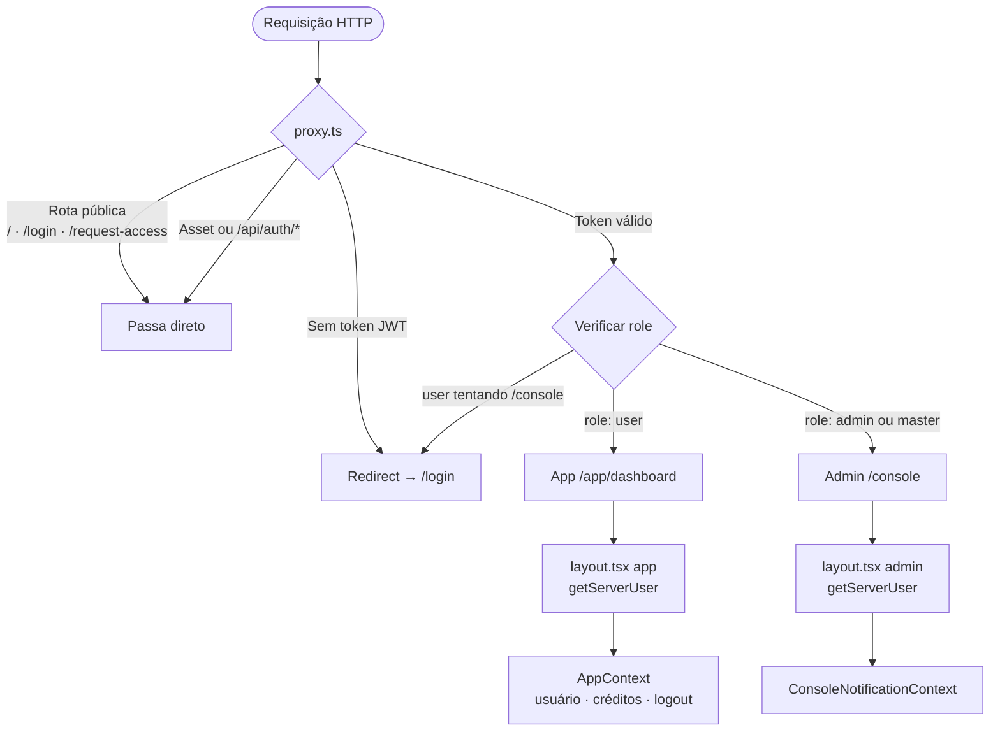

---

## Route Groups e Páginas

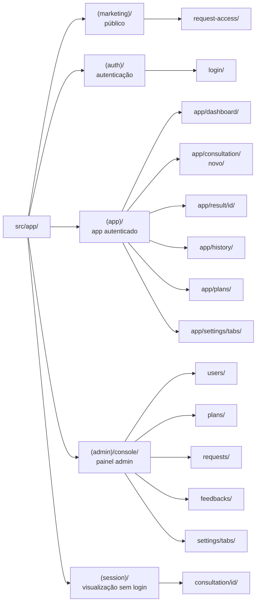

---

## Fluxo de Consulta (feature principal)


---

## Robustez da Gravação de Áudio

Camada de proteção contra falhas de hardware, silêncio prolongado e alucinações do Whisper. Implementada sobre `StepAudio` sem quebrar o fluxo existente.

### VAD + Wake Lock + Interrupção (client-side)

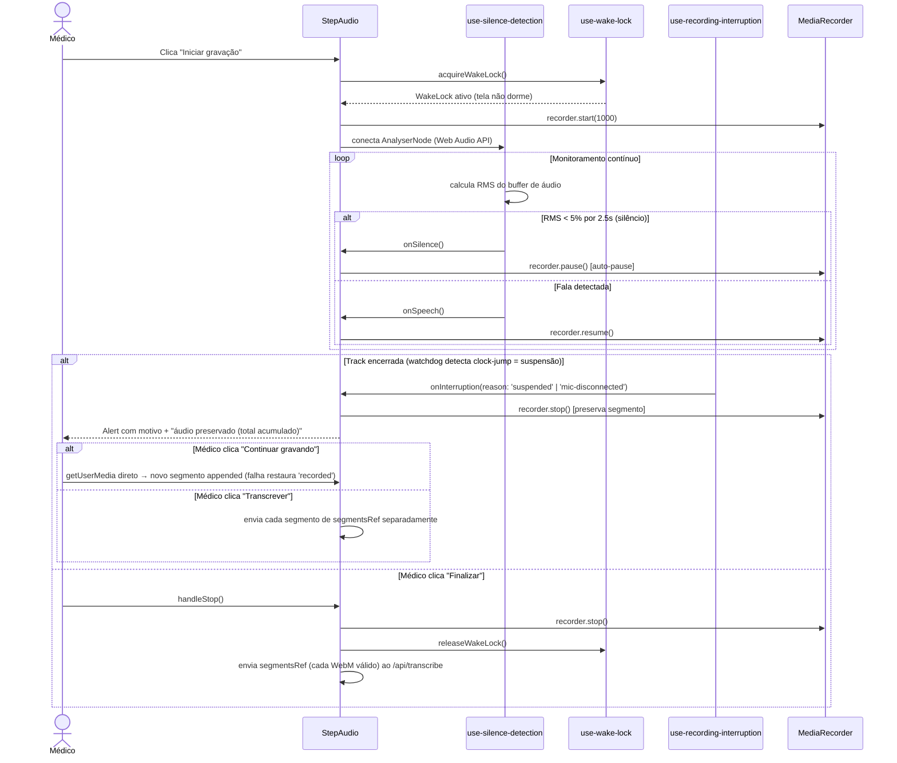

### Hardenização do Whisper + Filtro de Alucinações (server-side)

```mermaid
flowchart TD
    UP[/api/transcribe — N segmentos WebM independentes] --> TS[transcribeSegments]
    TS -->|um por vez| TC[transcribeInChunks por segmento]
    TC -->|temperature: 0\nTRANSCRIPTION_PROMPT| GR[Groq whisper-large-v3]
    GR -->|texto raw por chunk| HF[filterHallucinations]
    HF -->|remove frases isoladas conhecidas\n"tchau" · "obrigado" · "legendas amara.org" ...| JOIN[junta transcrições dos segmentos]
    JOIN --> OUT[Transcrição limpa]
    OUT --> ANM[/api/anamnesis — geração de relatório]
```

**Pontos-chave:**

- VAD é nativo (Web Audio API) — sem biblioteca externa, sem custo, sem conta.
- Wake Lock silencioso: não exibe alerta; só libera quando a gravação para.
- Interrupção distingue 2 razões (`suspended`, `mic-disconnected`) via watchdog de clock-jump (não `document.hidden`, que falha na hibernação real).
- Multi-segmento: `segmentsRef: Blob[]` acumula todos os trechos; cada WebM é enviado **separadamente** ao servidor (`transcribeSegments`) e as transcrições são juntadas — concatenar os bytes produziria um WebM inválido (só o 1º segmento seria lido).
- Filtro de alucinações só remove frase quando ela está **isolada** no chunk — preserva menções legítimas.
- `temperature: 0` e `TRANSCRIPTION_PROMPT` também protegem consultas no modo upload direto.

---

## Camadas do Servidor

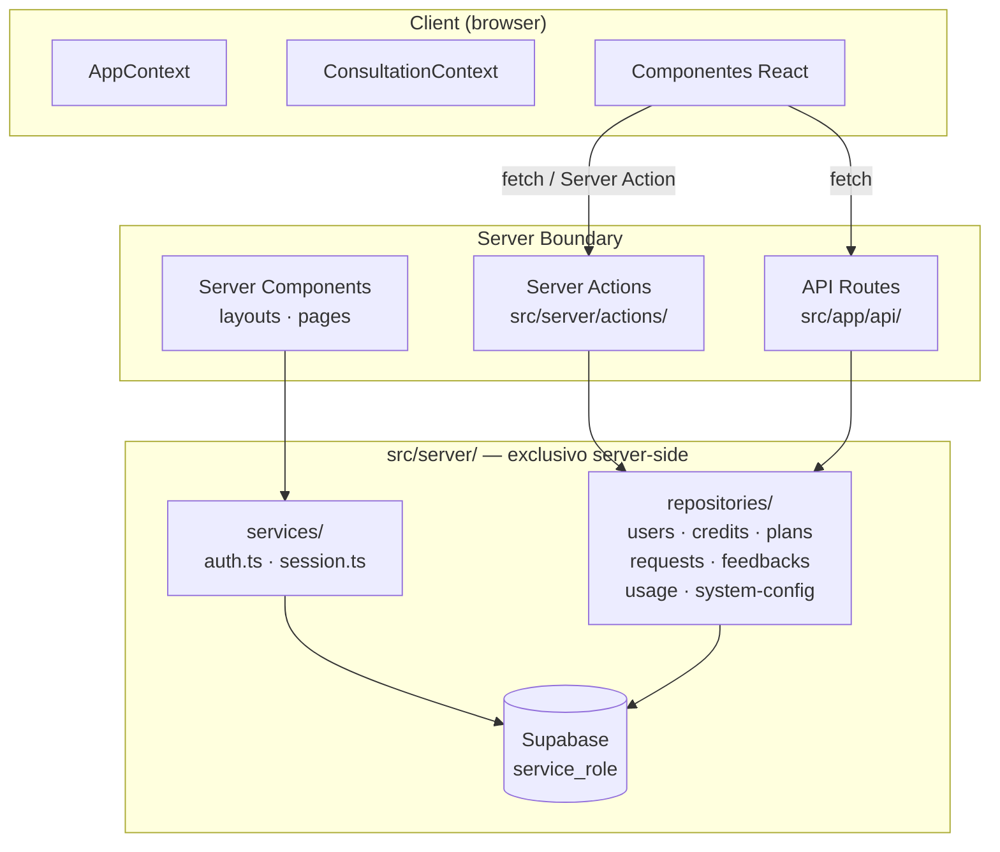

---

## API Routes

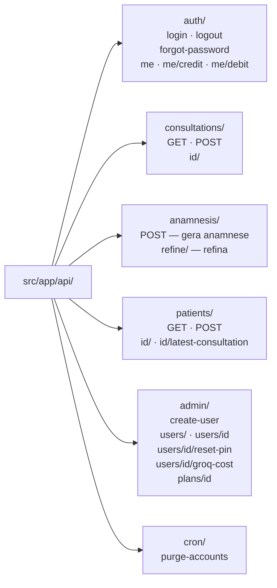

---

## Créditos — Duas Carteiras + Estorno Simétrico

Duas carteiras independentes em `users`:

- `credits_remaining` — saldo do plano (experimental/pago). Reset para `plan.quota` em toda troca de plano (padrão SaaS).
- `bonus_credits` — cortesia/urgência. Alimentada **só** pela injeção do master. Sem ciclo.

**Regras:**

1. Débito drena `bonus_credits` primeiro, depois `credits_remaining`.
2. Cada consulta registra `debit_source` ('bonus' | 'paid') no momento do débito.
3. Estorno (abandono sem uso de IA) volta para a **mesma carteira** indicada por `debit_source`.
4. `getCredits` retorna `bonus + paid` (validações de saldo).

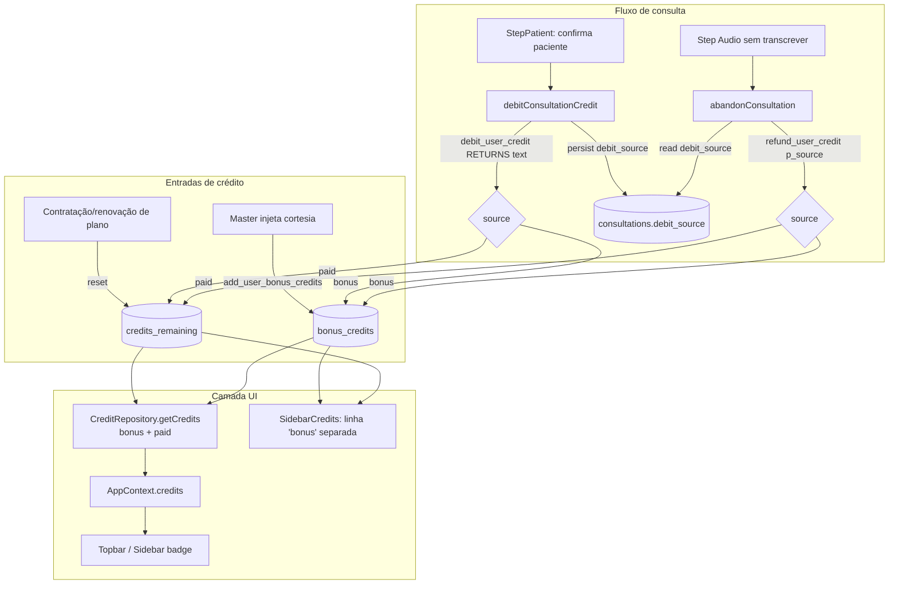

**Pontos críticos:**

- `AppProvider` sincroniza `credits` via `useEffect([initialCredits])` — sem isso, navegações no App Router não refletiam mudanças.
- `consultation-page-flow` chama `refreshCredits()` após `handleDebit` e dentro do `then` de `abandonConsultation`.

---

## Proteção de Rotas — Resumo

| Rota | Acesso | Verificação |
|------|--------|-------------|
| `/` · `/login` · `/request-access` | Público | Nenhuma |
| `/_next/*` · `/api/auth/*` · `/api/stats` | Ignorado pelo proxy | Nenhuma |
| `/app/dashboard` · `/app/consultation/*` · `/app/result/*` · `/app/history` · `/app/plans` · `/app/settings` | Autenticado | JWT válido |
| `/console/*` | Admin | JWT + role `admin` ou `master` |

---

## Componentes de UI — Padrão por Contexto

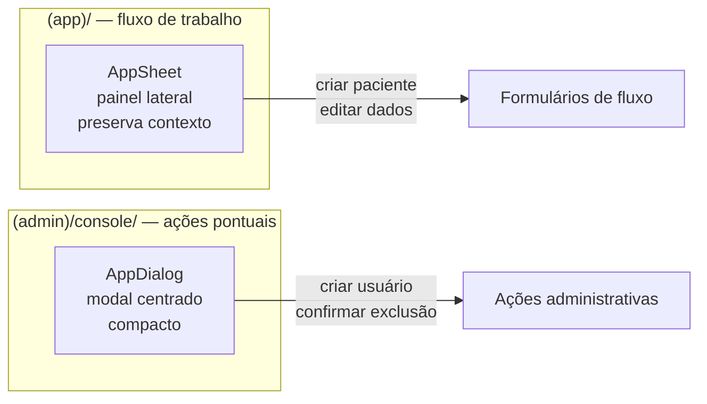

## Configurações do Console (master)

`(admin)/console/settings` — três abas:

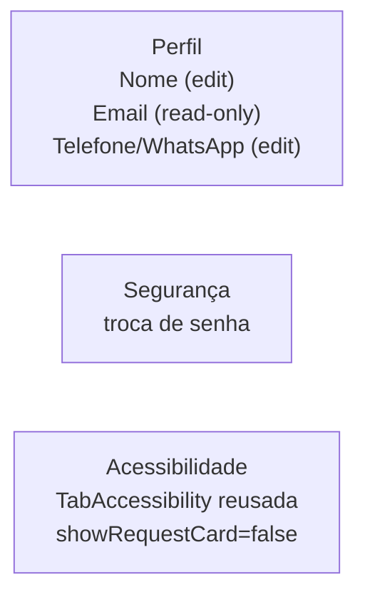

- **Perfil** → `updateMasterProfile` (Server Action, master-only) valida via `masterProfileSchema` e persiste `{ name, phone }`. Email é exibido read-only e nunca aceito na action (proteção contra mass assignment). O telefone tem peso real: o master recebe aviso de pedido de acesso no WhatsApp.
- **Acessibilidade** → reaproveita `TabAccessibility` do lado `(app)` com `showRequestCard={false}` (o master é quem recebe os pedidos, não os envia).

## Dados da Clínica

### Onboarding (3 abas obrigatórias)

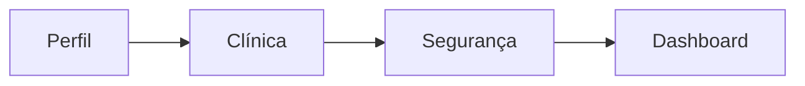

### Gate "Iniciar atendimento"

```mermaid
flowchart TD
    U[Usuário acessa /app/consultation/novo]
    U --> Q{isClinicComplete?}
    Q -- não --> R["redirect /app/settings?force=clinica&next=/app/consultation/novo"]
    R --> F[Aba Clínica travada e visível]
    F --> S[PATCH /api/users/me]
    S --> N["window.location.href = next"]
    N --> NA[/app/consultation/novo]
    Q -- sim --> NA
```

### Upload de logo da clínica

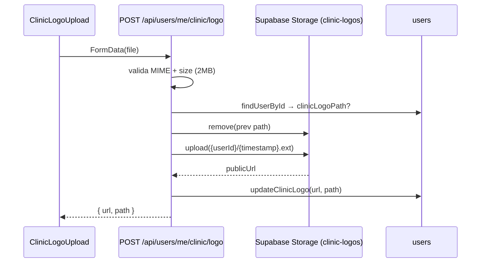

### Renderização nos documentos

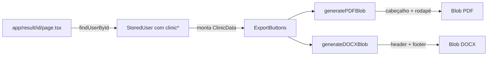

## Camada E2E (Playwright)

Suite de testes end-to-end localizada em `e2e/`. Cobre LP, login, app do usuario profissional e console master nos viewports mobile/tablet/laptop/desktop.

```mermaid
graph TD
    PW[Playwright runner] -->|sobe| DEV[pnpm dev :3000]
    PW -->|global-setup| GUARD[Valida ref do banco teste]
    GUARD -->|ok| FIXTURES[Fixtures]
    FIXTURES -->|service_role| SB[(Supabase teste)]
    FIXTURES -->|JWT direto| COOKIE[Cookie anamnese_auth]
    PW -->|executa| SPECS[Specs em 4 viewports]
    SPECS --> APP[App Next.js]
    APP -->|API| SB
    SPECS -.->|mock| AI[/api/transcribe, /api/anamnesis, /api/anamnesis/refine]
    PW -->|global-teardown| CLEANUP[cleanupE2eData LIKE e2e-
## Camada E2E (Playwright)

Suite de testes end-to-end localizada em `e2e/`. Cobre LP, login, app do usuario profissional e console master nos viewports mobile/tablet/laptop/desktop.

```mermaid
graph TD
    PW[Playwright runner] -->|sobe| DEV[pnpm dev :3000]
    PW -->|global-setup| GUARD[Valida ref do banco teste]
    GUARD -->|ok| FIXTURES[Fixtures auth/seed/mocks/session]
    FIXTURES -->|service_role| SB[(Supabase teste)]
    FIXTURES -->|JWT direto| COOKIE[Cookie anamnese_auth]
    PW -->|executa| SPECS[Specs em 4 viewports]
    SPECS --> APP[App Next.js]
    APP -->|API| SB
    SPECS -.->|mock| AI[api/transcribe + anamnesis + refine]
    PW -->|global-teardown| CLEANUP[cleanupE2eData LIKE e2e-%]
    CLEANUP --> SB
```

**Pontos-chave:**
- Guard rail bloqueia execucao contra producao (whitelist do ref de teste)
- Cada spec roda nos 4 viewports declarados em `playwright.config.ts`
- IA real nunca eh chamada — `mockAiEndpoints(page)` intercepta as 3 rotas
- Cleanup automatico ao final preserva master e dados sem prefixo `e2e-`
- Specs do console usam `loginAsMasterViaCookie` (JWT programatico) para evitar rate-limit de `/api/auth/login`
