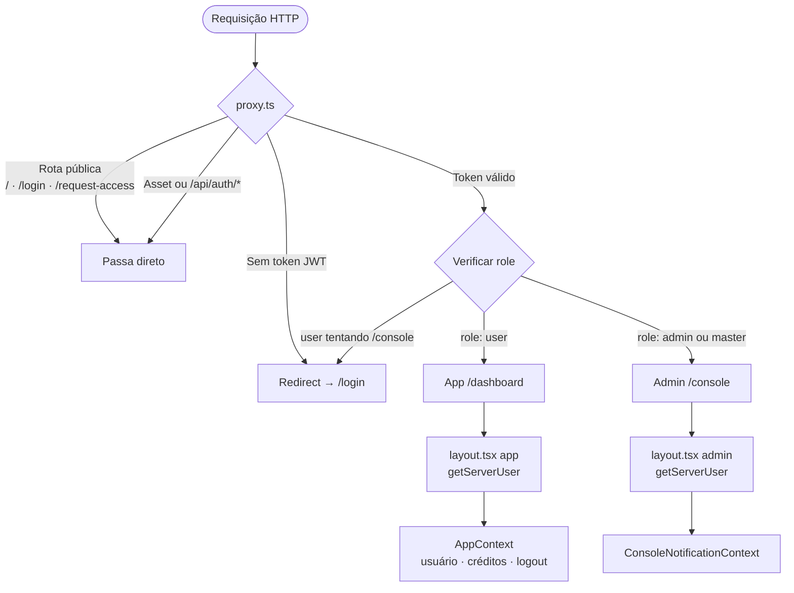
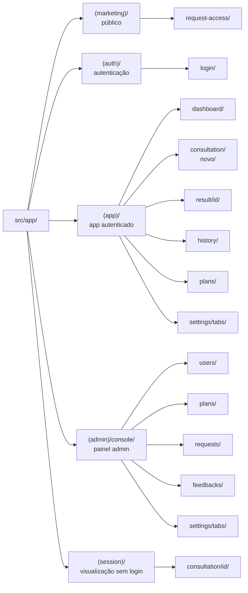
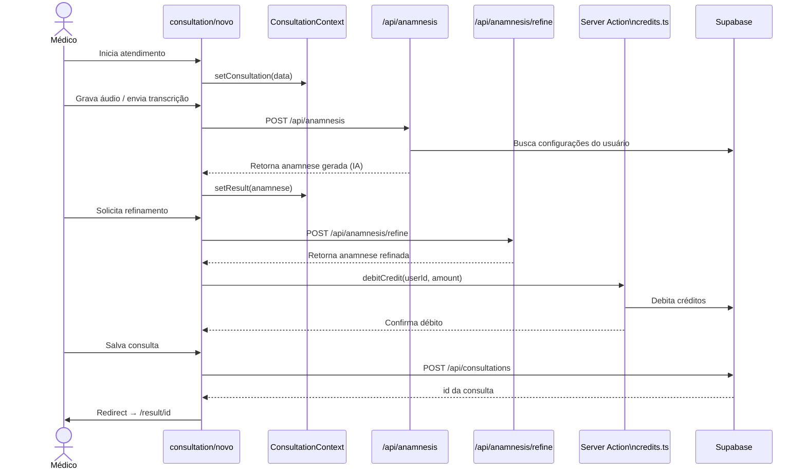
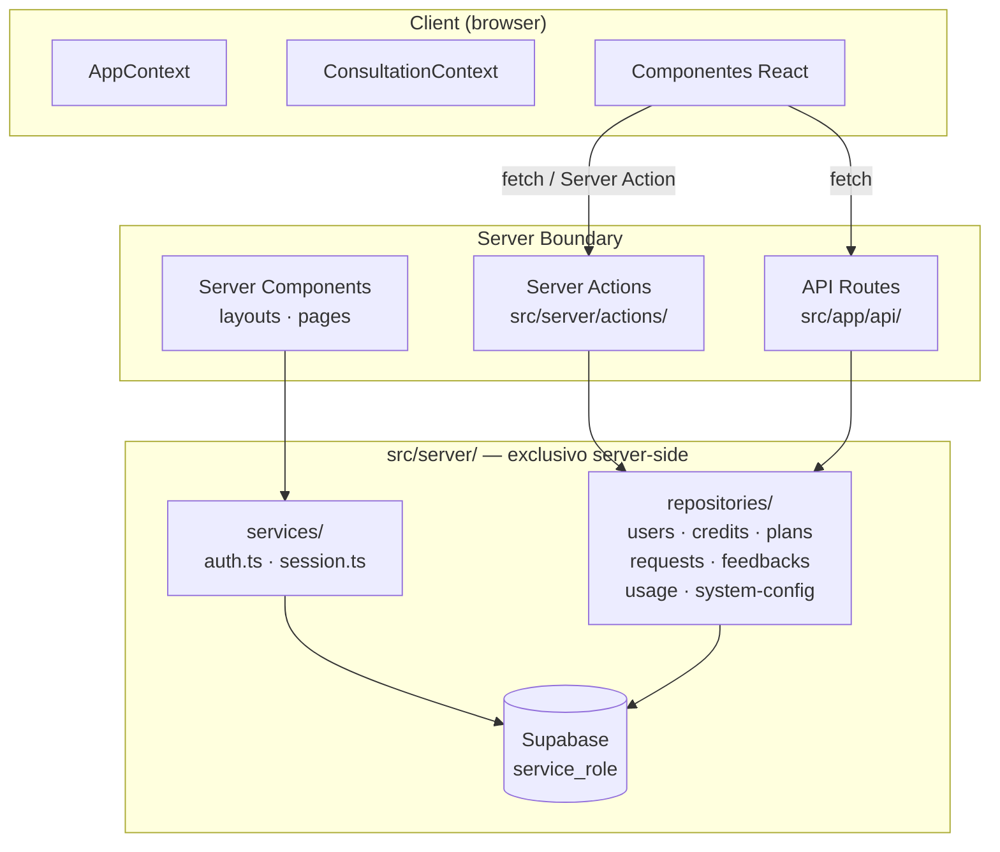
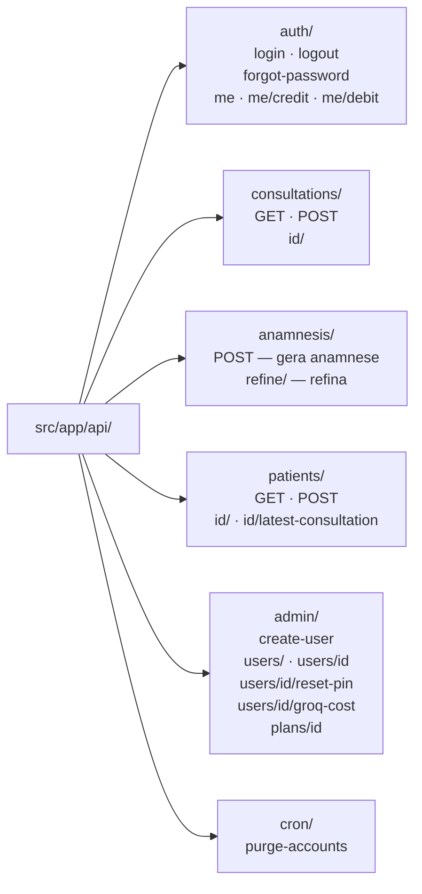
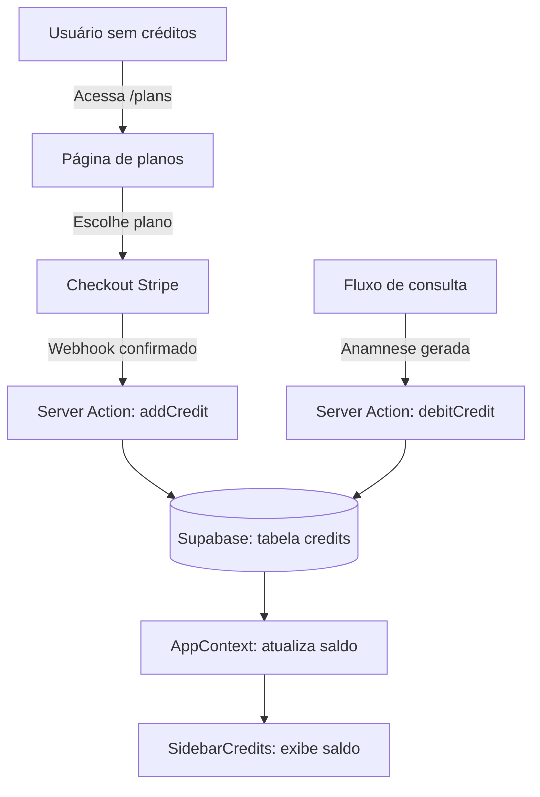
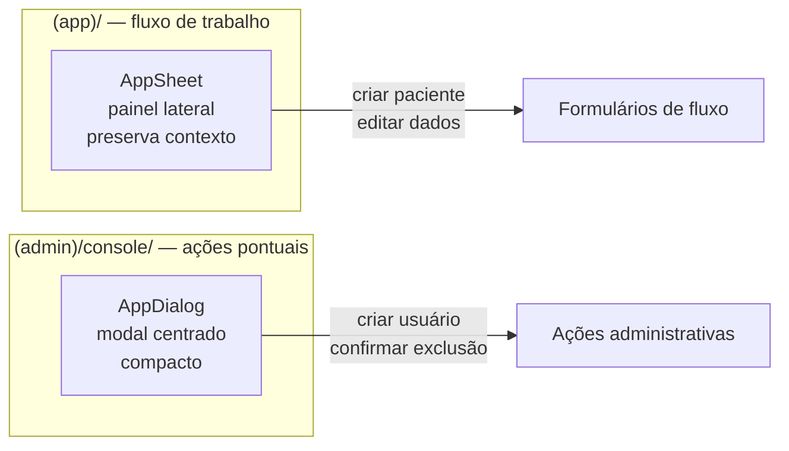

# Arquitetura — Anamnese IA

> Documento gerado automaticamente. Atualizar sempre que uma nova funcionalidade for implementada.

---

## Fluxo de Autenticação

---

## Route Groups e Páginas

---

## Fluxo de Consulta (feature principal)

---

## Camadas do Servidor

---

## API Routes

---

## Créditos — Ciclo de Vida

---

## Proteção de Rotas — Resumo

| Rota | Acesso | Verificação |
|------|--------|-------------|
| `/` · `/login` · `/request-access` | Público | Nenhuma |
| `/_next/*` · `/api/auth/*` · `/api/stats` | Ignorado pelo proxy | Nenhuma |
| `/dashboard` · `/consultation/*` · `/result/*` · `/history` · `/plans` · `/settings` | Autenticado | JWT válido |
| `/console/*` | Admin | JWT + role `admin` ou `master` |

---

## Componentes de UI — Padrão por Contexto

