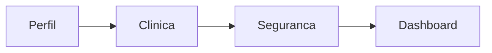
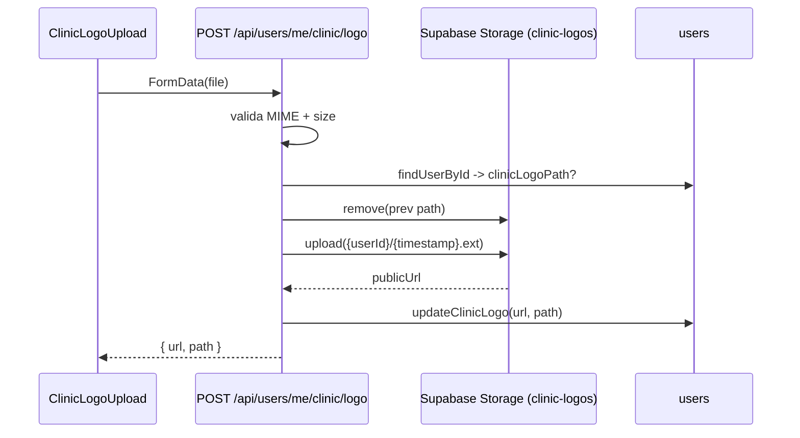

# Dados da Clínica — Implementation Plan

> **For agentic workers:** REQUIRED SUB-SKILL: Use superpowers:subagent-driven-development (recommended) or superpowers:executing-plans to implement this plan task-by-task. Steps use checkbox (`- [ ]`) syntax for tracking.

**Goal:** Coletar dados da clínica (logo + identificação + endereço + RT + horário) no onboarding e em `/settings`, e renderizá-los no cabeçalho/rodapé do PDF e DOCX gerados pela anamnese. Forçar usuários existentes a preencher antes de iniciar um novo atendimento.

**Architecture:** 13 colunas novas em `users` (nullable). Bucket `clinic-logos` no Supabase Storage (público, 2MB, MIME allowlist). Schema Zod `clinicSchema` com validação de dígito verificador de CNPJ. Aba `Clínica` nova em `/settings` (entre Perfil e Segurança no onboarding). Gate na rota `/consultation/novo` redireciona para `/settings?force=clinica&next=...`. Funções de export de PDF/DOCX recebem `clinic: ClinicData` e injetam cabeçalho/rodapé.

**Tech Stack:** Next.js 16 App Router, React 19, TypeScript, Supabase (service_role + Storage), Zod, React Hook Form, jsPDF, docx (lib), shadcn/ui, Vitest + RTL.

**Spec:** `docs/superpowers/specs/2026-05-21-dados-clinica-design.md`

---

## Mapa de arquivos

| Arquivo | Ação | Responsabilidade |
|---|---|---|
| `supabase/migrations/20260521_clinic_fields.sql` | criar | Migration com 13 colunas `clinic_*` em `users` |
| `src/lib/schemas.ts` | modificar | `clinicSchema` + helper `isValidCnpj` + `ClinicFormData` |
| `src/lib/clinic.ts` | criar | Tipo `ClinicData` + helper `isClinicComplete(user)` |
| `src/server/repositories/users.ts` | modificar | Campos clinic em `StoredUser`/`toStoredUser` + `updateClinicData` + `updateClinicLogo` + `clearClinicLogo` |
| `src/lib/routes.ts` | modificar | `API.clinicLogo` |
| `src/app/api/users/me/route.ts` | modificar | PATCH aceita campos `clinic_*` |
| `src/app/api/users/me/clinic/logo/route.ts` | criar | POST upload + DELETE remove logo |
| `src/app/(app)/settings/tabs/clinic-logo-upload.tsx` | criar | Componente client de upload com preview |
| `src/app/(app)/settings/tabs/tab-clinic.tsx` | criar | Aba Clínica com 3 cards (Identificação, Endereço, Adicionais) |
| `src/app/(app)/settings/settings-client.tsx` | modificar | Adicionar aba `clinica` ao fluxo de onboarding + suporte a `force=clinica` |
| `src/app/(app)/settings/page.tsx` | modificar | Ler `searchParams.force` e `searchParams.next` |
| `src/app/(app)/consultation/novo/page.tsx` | modificar | Gate: redirect se `!isClinicComplete` |
| `src/lib/pdf.ts` | modificar | Cabeçalho com logo + identificação; rodapé com endereço + RT + horário |
| `src/lib/docx.ts` | modificar | Equivalente do PDF no formato DOCX |
| `src/components/export/export-buttons.tsx` | modificar | Passar `clinic` para as funções de export |
| `docs/architecture.md` | modificar | Atualizar diagrama onboarding + adicionar diagrama do gate |

Testes a criar/modificar junto: cada `.test.ts(x)` no mesmo diretório do arquivo testado, exceto integração que vive em `src/tests/integration/`.

---

## Convenções

- Commit messages em pt-BR seguindo Conventional Commits (`feat(escopo): ...`)
- `pnpm test` (unit), `pnpm run test:integration` (integração), `pnpm run test:all` (tudo) — **nunca rodar build**
- TDD obrigatório: RED → GREEN → REFACTOR. Repositório Supabase: RED unit (mocked) → GREEN → RED integration → GREEN
- TypeScript: proibido `any`; usar `unknown`
- Rotas: nunca hardcoded — sempre `ROUTES.*` / `API.*` de `src/lib/routes.ts`
- Formulários: `FieldInput` + `FieldLabel` (não shadcn `<Input>`), `mode: 'onTouched'`, `toast.promise` com `loading: 'Aguarde...'`
- Redirects pós-mutation com mudança de estado server: `window.location.href`

---

## Task 1: Migration — colunas `clinic_*` em `users`

**Files:**
- Create: `supabase/migrations/20260521_clinic_fields.sql`

- [ ] **Step 1: Criar migration**

```sql
-- 20260521_clinic_fields.sql
alter table public.users
  add column if not exists clinic_name text,
  add column if not exists clinic_cnpj text,
  add column if not exists clinic_address text,
  add column if not exists clinic_cep text,
  add column if not exists clinic_phone text,
  add column if not exists clinic_email text,
  add column if not exists clinic_website text,
  add column if not exists clinic_logo_url text,
  add column if not exists clinic_logo_path text,
  add column if not exists clinic_rt_is_self boolean not null default true,
  add column if not exists clinic_rt_name text,
  add column if not exists clinic_rt_registry text,
  add column if not exists clinic_business_hours text;
```

- [ ] **Step 2: Aplicar via MCP**

Usar `mcp__supabase__apply_migration` com `name: "clinic_fields"` e o SQL acima.

- [ ] **Step 3: Verificar colunas**

Usar `mcp__supabase__execute_sql`:
```sql
select column_name from information_schema.columns
where table_schema='public' and table_name='users' and column_name like 'clinic_%';
```
Expected: 13 linhas.

- [ ] **Step 4: Commit**

```bash
git add supabase/migrations/20260521_clinic_fields.sql
git commit -m "feat(db): adiciona colunas de dados da clinica em users"
```

---

## Task 2: Helper de validação de CNPJ + tipos da clínica

**Files:**
- Create: `src/lib/clinic.ts`
- Create: `src/lib/clinic.test.ts`

- [ ] **Step 1: Escrever teste em `src/lib/clinic.test.ts`**

```typescript
import { describe, it, expect } from 'vitest'
import { isValidCnpj, isClinicComplete } from './clinic'
import type { StoredUser } from '@/server/repositories/users'

describe('isValidCnpj', () => {
  it('aceita CNPJ valido sem mascara', () => {
    expect(isValidCnpj('11222333000181')).toBe(true)
  })
  it('rejeita CNPJ com digito verificador invalido', () => {
    expect(isValidCnpj('11222333000180')).toBe(false)
  })
  it('rejeita CNPJ com tamanho errado', () => {
    expect(isValidCnpj('123')).toBe(false)
  })
  it('rejeita CNPJ com todos digitos iguais', () => {
    expect(isValidCnpj('11111111111111')).toBe(false)
  })
})

function baseUser(overrides: Partial<StoredUser> = {}): StoredUser {
  return {
    id: 'u1', name: 'Doc', email: 'd@x.com', passwordHash: 'h', role: 'user',
    planId: 'experimental', planSelected: false, onboardingCompleted: false,
    passwordIsTemp: false, blocked: false, createdAt: '2026-01-01',
    deletionScheduledAt: null, bonusCredits: 0, minutesPerConsultation: 45,
    pinIsTemp: false,
    clinicName: 'Clinica X', clinicCnpj: '11222333000181',
    clinicAddress: 'Rua 1', clinicCep: '01000000',
    clinicPhone: '11999999999', clinicEmail: 'c@x.com',
    clinicLogoUrl: 'https://x/y.png', clinicLogoPath: 'u1/123.png',
    clinicRtIsSelf: true,
    ...overrides,
  } as StoredUser
}

describe('isClinicComplete', () => {
  it('true quando todos obrigatorios preenchidos e RT = self', () => {
    expect(isClinicComplete(baseUser())).toBe(true)
  })
  it('false quando logo ausente', () => {
    expect(isClinicComplete(baseUser({ clinicLogoUrl: undefined }))).toBe(false)
  })
  it('false quando RT nao e self e nome do RT ausente', () => {
    expect(isClinicComplete(baseUser({ clinicRtIsSelf: false, clinicRtRegistry: 'CRM/SP 1' }))).toBe(false)
  })
  it('true quando RT nao e self e nome + registro preenchidos', () => {
    expect(isClinicComplete(baseUser({
      clinicRtIsSelf: false, clinicRtName: 'Dr Y', clinicRtRegistry: 'CRM/SP 1',
    }))).toBe(true)
  })
})
```

- [ ] **Step 2: Rodar teste e ver falhar**

Run: `pnpm test src/lib/clinic.test.ts`
Expected: FAIL (arquivo `clinic.ts` não existe)

- [ ] **Step 3: Implementar `src/lib/clinic.ts`**

```typescript
import type { StoredUser } from '@/server/repositories/users'

export interface ClinicData {
  clinicName: string
  clinicCnpj: string
  clinicAddress: string
  clinicCep: string
  clinicPhone: string
  clinicEmail: string
  clinicLogoUrl: string
  clinicLogoPath: string
  clinicWebsite?: string
  clinicRtIsSelf: boolean
  clinicRtName?: string
  clinicRtRegistry?: string
  clinicBusinessHours?: string
}

export function isValidCnpj(cnpj: string): boolean {
  const digits = cnpj.replace(/\D/g, '')
  if (digits.length !== 14) return false
  if (/^(\d)\1{13}$/.test(digits)) return false
  const calc = (slice: string, weights: number[]) => {
    const sum = slice.split('').reduce((acc, d, i) => acc + Number(d) * weights[i], 0)
    const rem = sum % 11
    return rem < 2 ? 0 : 11 - rem
  }
  const w1 = [5,4,3,2,9,8,7,6,5,4,3,2]
  const w2 = [6,5,4,3,2,9,8,7,6,5,4,3,2]
  return calc(digits.slice(0,12), w1) === Number(digits[12])
      && calc(digits.slice(0,13), w2) === Number(digits[13])
}

export function isClinicComplete(user: StoredUser): boolean {
  const required = [
    user.clinicName, user.clinicCnpj, user.clinicAddress, user.clinicCep,
    user.clinicPhone, user.clinicEmail, user.clinicLogoUrl, user.clinicLogoPath,
  ]
  if (required.some((v) => !v || String(v).trim() === '')) return false
  if (user.clinicRtIsSelf === false) {
    if (!user.clinicRtName?.trim() || !user.clinicRtRegistry?.trim()) return false
  }
  return true
}
```

- [ ] **Step 4: Rodar teste e ver passar**

Run: `pnpm test src/lib/clinic.test.ts`
Expected: PASS (8 testes)

> Obs.: o tipo `StoredUser` ainda não tem os campos `clinic*`. O TS vai reclamar no test e no helper até Task 4. Ignorar warnings agora; Task 4 corrige.

- [ ] **Step 5: Commit**

```bash
git add src/lib/clinic.ts src/lib/clinic.test.ts
git commit -m "feat(clinic): adiciona helpers isValidCnpj e isClinicComplete"
```

---

## Task 3: Schema Zod `clinicSchema`

**Files:**
- Modify: `src/lib/schemas.ts`
- Create: `src/lib/schemas-clinic.test.ts`

- [ ] **Step 1: Escrever teste em `src/lib/schemas-clinic.test.ts`**

```typescript
import { describe, it, expect } from 'vitest'
import { clinicSchema } from './schemas'

const valid = {
  clinicName: 'Clinica Teste',
  clinicCnpj: '11222333000181',
  clinicAddress: 'Rua A, 100, Sao Paulo - SP',
  clinicCep: '01000000',
  clinicPhone: '(11) 99999-9999',
  clinicEmail: 'contato@clinica.com',
  clinicWebsite: '',
  clinicRtIsSelf: true,
  clinicRtName: '',
  clinicRtRegistry: '',
  clinicBusinessHours: '',
}

describe('clinicSchema', () => {
  it('aceita payload valido com RT self', () => {
    expect(clinicSchema.safeParse(valid).success).toBe(true)
  })

  it('rejeita CNPJ com digito invalido', () => {
    const r = clinicSchema.safeParse({ ...valid, clinicCnpj: '11222333000180' })
    expect(r.success).toBe(false)
  })

  it('aceita CNPJ com mascara e normaliza', () => {
    const r = clinicSchema.safeParse({ ...valid, clinicCnpj: '11.222.333/0001-81' })
    expect(r.success).toBe(true)
    if (r.success) expect(r.data.clinicCnpj).toBe('11222333000181')
  })

  it('rejeita CEP fora do formato', () => {
    expect(clinicSchema.safeParse({ ...valid, clinicCep: '1234' }).success).toBe(false)
  })

  it('aceita CEP com hifen e normaliza', () => {
    const r = clinicSchema.safeParse({ ...valid, clinicCep: '01000-000' })
    expect(r.success).toBe(true)
    if (r.success) expect(r.data.clinicCep).toBe('01000000')
  })

  it('rejeita telefone curto', () => {
    expect(clinicSchema.safeParse({ ...valid, clinicPhone: '123' }).success).toBe(false)
  })

  it('rejeita email invalido', () => {
    expect(clinicSchema.safeParse({ ...valid, clinicEmail: 'naoemail' }).success).toBe(false)
  })

  it('exige nome e registro do RT quando rt_is_self = false', () => {
    const r = clinicSchema.safeParse({ ...valid, clinicRtIsSelf: false })
    expect(r.success).toBe(false)
  })

  it('aceita rt_is_self = false com nome e registro preenchidos', () => {
    const r = clinicSchema.safeParse({
      ...valid, clinicRtIsSelf: false,
      clinicRtName: 'Dra. Maria', clinicRtRegistry: 'CRM/SP 123456',
    })
    expect(r.success).toBe(true)
  })

  it('normaliza website sem https', () => {
    const r = clinicSchema.safeParse({ ...valid, clinicWebsite: 'clinica.com.br' })
    expect(r.success).toBe(true)
    if (r.success) expect(r.data.clinicWebsite).toBe('https://clinica.com.br')
  })

  it('aceita website vazio (opcional)', () => {
    expect(clinicSchema.safeParse({ ...valid, clinicWebsite: '' }).success).toBe(true)
  })
})
```

- [ ] **Step 2: Rodar teste e ver falhar**

Run: `pnpm test src/lib/schemas-clinic.test.ts`
Expected: FAIL (`clinicSchema` não exportado)

- [ ] **Step 3: Adicionar `clinicSchema` em `src/lib/schemas.ts`**

No topo, importar o helper (logo após a linha `import { z } from 'zod'`):

```typescript
import { isValidCnpj } from './clinic'
```

No final do arquivo, adicionar:

```typescript
const PHONE_BR = /^(\(?\d{2}\)?[\s-]?)?\d{4,5}-?\d{4}$/

export const clinicSchema = z.object({
  clinicName: z.string().min(2, 'Nome da clinica obrigatorio').max(120).trim(),
  clinicCnpj: z
    .string()
    .trim()
    .transform((v) => v.replace(/\D/g, ''))
    .refine((v) => v.length === 14, 'CNPJ deve ter 14 digitos')
    .refine(isValidCnpj, 'CNPJ invalido'),
  clinicAddress: z.string().min(5, 'Endereco obrigatorio').max(200).trim(),
  clinicCep: z
    .string()
    .trim()
    .transform((v) => v.replace(/\D/g, ''))
    .refine((v) => /^\d{8}$/.test(v), 'CEP invalido'),
  clinicPhone: z
    .string()
    .trim()
    .max(20)
    .refine((v) => PHONE_BR.test(v), 'Telefone invalido'),
  clinicEmail: z.string().trim().max(120).email('Email invalido'),
  clinicWebsite: z
    .string()
    .trim()
    .max(200)
    .optional()
    .transform((v) => {
      if (!v) return ''
      return /^https?:\/\//i.test(v) ? v : `https://${v}`
    }),
  clinicRtIsSelf: z.boolean(),
  clinicRtName: z.string().trim().max(120).optional().default(''),
  clinicRtRegistry: z.string().trim().max(60).optional().default(''),
  clinicBusinessHours: z.string().trim().max(200).optional().default(''),
}).superRefine((data, ctx) => {
  if (data.clinicRtIsSelf === false) {
    if (!data.clinicRtName || data.clinicRtName.trim().length < 2) {
      ctx.addIssue({ code: z.ZodIssueCode.custom, path: ['clinicRtName'], message: 'Nome do RT obrigatorio' })
    }
    if (!data.clinicRtRegistry || data.clinicRtRegistry.trim().length < 2) {
      ctx.addIssue({ code: z.ZodIssueCode.custom, path: ['clinicRtRegistry'], message: 'Registro do RT obrigatorio' })
    }
  }
})

export type ClinicFormData = z.infer<typeof clinicSchema>
```

- [ ] **Step 4: Rodar teste e ver passar**

Run: `pnpm test src/lib/schemas-clinic.test.ts`
Expected: PASS (11 testes)

- [ ] **Step 5: Commit**

```bash
git add src/lib/schemas.ts src/lib/schemas-clinic.test.ts
git commit -m "feat(schemas): adiciona clinicSchema com validacao de CNPJ, CEP e RT condicional"
```

---

## Task 4: Repositório — estender `users.ts`

**Files:**
- Modify: `src/server/repositories/users.ts`
- Create: `src/server/repositories/users-clinic.test.ts`

- [ ] **Step 1: Escrever teste em `src/server/repositories/users-clinic.test.ts`**

```typescript
import { describe, it, expect, vi, beforeEach } from 'vitest'

const mockSupabase = vi.hoisted(() => ({
  from: vi.fn().mockReturnThis(),
  select: vi.fn().mockReturnThis(),
  eq: vi.fn().mockReturnThis(),
  single: vi.fn(),
  insert: vi.fn().mockReturnThis(),
  update: vi.fn().mockReturnThis(),
  delete: vi.fn().mockReturnThis(),
}))

vi.mock('@/server/supabase', () => ({ supabase: mockSupabase }))

import { updateClinicData, updateClinicLogo, clearClinicLogo } from './users'

describe('updateClinicData', () => {
  beforeEach(() => { vi.clearAllMocks() })

  it('mapeia campos camelCase -> snake_case e nao toca em logo', async () => {
    await updateClinicData('u1', {
      clinicName: 'C',
      clinicCnpj: '11222333000181',
      clinicAddress: 'R1',
      clinicCep: '01000000',
      clinicPhone: '11999999999',
      clinicEmail: 'c@x.com',
      clinicWebsite: 'https://c.com',
      clinicRtIsSelf: true,
      clinicRtName: '',
      clinicRtRegistry: '',
      clinicBusinessHours: 'Seg-Sex',
    })
    expect(mockSupabase.update).toHaveBeenCalledWith(expect.objectContaining({
      clinic_name: 'C',
      clinic_cnpj: '11222333000181',
      clinic_address: 'R1',
      clinic_cep: '01000000',
      clinic_phone: '11999999999',
      clinic_email: 'c@x.com',
      clinic_website: 'https://c.com',
      clinic_rt_is_self: true,
      clinic_rt_name: '',
      clinic_rt_registry: '',
      clinic_business_hours: 'Seg-Sex',
    }))
    const call = mockSupabase.update.mock.calls[0][0] as Record<string, unknown>
    expect(call).not.toHaveProperty('clinic_logo_url')
    expect(call).not.toHaveProperty('clinic_logo_path')
  })
})

describe('updateClinicLogo', () => {
  beforeEach(() => { vi.clearAllMocks() })
  it('atualiza apenas url e path', async () => {
    await updateClinicLogo('u1', { url: 'https://x/y.png', path: 'u1/123.png' })
    expect(mockSupabase.update).toHaveBeenCalledWith({
      clinic_logo_url: 'https://x/y.png',
      clinic_logo_path: 'u1/123.png',
    })
  })
})

describe('clearClinicLogo', () => {
  beforeEach(() => { vi.clearAllMocks() })
  it('zera url e path', async () => {
    await clearClinicLogo('u1')
    expect(mockSupabase.update).toHaveBeenCalledWith({
      clinic_logo_url: null,
      clinic_logo_path: null,
    })
  })
})
```

- [ ] **Step 2: Rodar teste e ver falhar**

Run: `pnpm test src/server/repositories/users-clinic.test.ts`
Expected: FAIL (funções não existem)

- [ ] **Step 3: Estender `src/server/repositories/users.ts`**

(a) Adicionar campos ao `StoredUser`:

```typescript
export interface StoredUser {
  id: string
  name: string
  email: string
  passwordHash: string
  role: UserRole
  specialty?: string
  phone?: string
  crmType?: string
  crmNumber?: string
  crmUf?: string
  planId: string
  planSelected: boolean
  onboardingCompleted: boolean
  passwordIsTemp: boolean
  blocked: boolean
  createdAt: string
  creditsRemaining?: number
  deletionScheduledAt: string | null
  bonusCredits: number
  minutesPerConsultation: number
  pinHash?: string
  pinIsTemp: boolean
  // ─── clinic ───
  clinicName?: string
  clinicCnpj?: string
  clinicAddress?: string
  clinicCep?: string
  clinicPhone?: string
  clinicEmail?: string
  clinicWebsite?: string
  clinicLogoUrl?: string
  clinicLogoPath?: string
  clinicRtIsSelf: boolean
  clinicRtName?: string
  clinicRtRegistry?: string
  clinicBusinessHours?: string
}
```

(b) Estender `toStoredUser` (adicionar antes do `}` de fechamento do return):

```typescript
    clinicName: (row.clinic_name as string | null) ?? undefined,
    clinicCnpj: (row.clinic_cnpj as string | null) ?? undefined,
    clinicAddress: (row.clinic_address as string | null) ?? undefined,
    clinicCep: (row.clinic_cep as string | null) ?? undefined,
    clinicPhone: (row.clinic_phone as string | null) ?? undefined,
    clinicEmail: (row.clinic_email as string | null) ?? undefined,
    clinicWebsite: (row.clinic_website as string | null) ?? undefined,
    clinicLogoUrl: (row.clinic_logo_url as string | null) ?? undefined,
    clinicLogoPath: (row.clinic_logo_path as string | null) ?? undefined,
    clinicRtIsSelf: (row.clinic_rt_is_self as boolean | null) ?? true,
    clinicRtName: (row.clinic_rt_name as string | null) ?? undefined,
    clinicRtRegistry: (row.clinic_rt_registry as string | null) ?? undefined,
    clinicBusinessHours: (row.clinic_business_hours as string | null) ?? undefined,
```

(c) Adicionar funções no final do arquivo:

```typescript
import type { ClinicFormData } from '@/lib/schemas'

export async function updateClinicData(id: string, data: ClinicFormData): Promise<void> {
  const update: Record<string, unknown> = {
    clinic_name:            data.clinicName,
    clinic_cnpj:            data.clinicCnpj,
    clinic_address:         data.clinicAddress,
    clinic_cep:             data.clinicCep,
    clinic_phone:           data.clinicPhone,
    clinic_email:           data.clinicEmail,
    clinic_website:         data.clinicWebsite ?? '',
    clinic_rt_is_self:      data.clinicRtIsSelf,
    clinic_rt_name:         data.clinicRtName ?? '',
    clinic_rt_registry:     data.clinicRtRegistry ?? '',
    clinic_business_hours:  data.clinicBusinessHours ?? '',
  }
  const { error } = await supabase.from('users').update(update).eq('id', id)
  if (error) throw new Error(`updateClinicData failed: ${error.message}`)
}

export async function updateClinicLogo(id: string, logo: { url: string; path: string }): Promise<void> {
  const { error } = await supabase.from('users').update({
    clinic_logo_url: logo.url,
    clinic_logo_path: logo.path,
  }).eq('id', id)
  if (error) throw new Error(`updateClinicLogo failed: ${error.message}`)
}

export async function clearClinicLogo(id: string): Promise<void> {
  const { error } = await supabase.from('users').update({
    clinic_logo_url: null,
    clinic_logo_path: null,
  }).eq('id', id)
  if (error) throw new Error(`clearClinicLogo failed: ${error.message}`)
}
```

- [ ] **Step 4: Rodar teste e ver passar**

Run: `pnpm test src/server/repositories/users-clinic.test.ts`
Expected: PASS (3 testes)

- [ ] **Step 5: Rodar suíte unit completa**

Run: `pnpm test`
Expected: 0 falhas (testes anteriores continuam passando).

- [ ] **Step 6: Commit**

```bash
git add src/server/repositories/users.ts src/server/repositories/users-clinic.test.ts
git commit -m "feat(users): adiciona updateClinicData, updateClinicLogo e clearClinicLogo"
```

---

## Task 5: Rotas centralizadas

**Files:**
- Modify: `src/lib/routes.ts`

- [ ] **Step 1: Adicionar entrada no `API`**

No bloco `export const API = { ... }`, dentro da seção `App` (após `mePin`):

```typescript
  clinicLogo:     '/api/users/me/clinic/logo',
```

- [ ] **Step 2: Commit**

```bash
git add src/lib/routes.ts
git commit -m "feat(routes): adiciona API.clinicLogo"
```

---

## Task 6: Endpoint logo — POST e DELETE

**Files:**
- Create: `src/app/api/users/me/clinic/logo/route.ts`
- Create: `src/tests/integration/clinic-logo.integration.test.ts`

> Storage usa o cliente `service_role` do bucket `clinic-logos` (já criado no Supabase).

- [ ] **Step 1: Escrever teste de integração**

`src/tests/integration/clinic-logo.integration.test.ts`:

```typescript
// @vitest-environment node
import { describe, it, expect, beforeEach, afterEach } from 'vitest'
import { POST, DELETE } from '@/app/api/users/me/clinic/logo/route'
import { seedUser, cleanupUsers } from '@/tests/integration/seed'
import { signSession } from '@/server/services/session'
import { supabase } from '@/server/supabase'

const BUCKET = 'clinic-logos'

async function buildRequest(method: 'POST' | 'DELETE', userId: string, body?: FormData) {
  const token = await signSession({ sub: userId, role: 'user' })
  return new Request('http://localhost/api/users/me/clinic/logo', {
    method,
    headers: { cookie: `anamnese_auth=${token}` },
    body,
  })
}

function pngFile(bytes = 100): File {
  const arr = new Uint8Array(bytes)
  return new File([arr], 'logo.png', { type: 'image/png' })
}

describe('clinic logo endpoint', () => {
  let userId: string
  beforeEach(async () => { userId = (await seedUser()).id })
  afterEach(async () => { await cleanupUsers() })

  it('rejeita sem auth', async () => {
    const res = await POST(new Request('http://localhost/api/users/me/clinic/logo', { method: 'POST' }))
    expect(res.status).toBe(401)
  })

  it('rejeita MIME nao permitido', async () => {
    const fd = new FormData()
    fd.append('file', new File([new Uint8Array(10)], 'a.txt', { type: 'text/plain' }))
    const res = await POST(await buildRequest('POST', userId, fd))
    expect(res.status).toBe(415)
  })

  it('rejeita arquivo > 2MB', async () => {
    const big = new File([new Uint8Array(2 * 1024 * 1024 + 1)], 'big.png', { type: 'image/png' })
    const fd = new FormData(); fd.append('file', big)
    const res = await POST(await buildRequest('POST', userId, fd))
    expect(res.status).toBe(413)
  })

  it('upload salva url e path em users', async () => {
    const fd = new FormData(); fd.append('file', pngFile())
    const res = await POST(await buildRequest('POST', userId, fd))
    expect(res.status).toBe(200)
    const body = await res.json() as { url: string; path: string }
    expect(body.url).toContain(BUCKET)

    const { data } = await supabase.from('users').select('clinic_logo_url, clinic_logo_path').eq('id', userId).single()
    expect(data?.clinic_logo_url).toBe(body.url)
    expect(data?.clinic_logo_path).toBe(body.path)

    // cleanup do bucket
    await supabase.storage.from(BUCKET).remove([body.path])
  })

  it('segundo upload deleta logo anterior', async () => {
    const r1 = await POST(await buildRequest('POST', userId, (() => { const f = new FormData(); f.append('file', pngFile()); return f })()))
    const b1 = await r1.json() as { path: string }
    const r2 = await POST(await buildRequest('POST', userId, (() => { const f = new FormData(); f.append('file', pngFile()); return f })()))
    const b2 = await r2.json() as { path: string }
    expect(b2.path).not.toBe(b1.path)
    const { data } = await supabase.storage.from(BUCKET).list(userId)
    expect(data?.find((f) => f.name === b1.path.split('/').pop())).toBeUndefined()
    await supabase.storage.from(BUCKET).remove([b2.path])
  })

  it('DELETE zera colunas e remove do bucket', async () => {
    const fd = new FormData(); fd.append('file', pngFile())
    const post = await POST(await buildRequest('POST', userId, fd))
    const { path } = await post.json() as { path: string }

    const res = await DELETE(await buildRequest('DELETE', userId))
    expect(res.status).toBe(204)

    const { data } = await supabase.from('users').select('clinic_logo_url, clinic_logo_path').eq('id', userId).single()
    expect(data?.clinic_logo_url).toBeNull()
    expect(data?.clinic_logo_path).toBeNull()
    const list = await supabase.storage.from(BUCKET).list(userId)
    expect(list.data?.find((f) => f.name === path.split('/').pop())).toBeUndefined()
  })
})
```

- [ ] **Step 2: Rodar e ver falhar**

Run: `pnpm run test:integration src/tests/integration/clinic-logo.integration.test.ts`
Expected: FAIL (route não existe)

- [ ] **Step 3: Implementar route**

`src/app/api/users/me/clinic/logo/route.ts`:

```typescript
import { NextResponse } from 'next/server'
import { getServerUser } from '@/server/services/session'
import { supabase } from '@/server/supabase'
import { updateClinicLogo, clearClinicLogo, findUserById } from '@/server/repositories/users'

const BUCKET = 'clinic-logos'
const MAX_BYTES = 2 * 1024 * 1024
const ALLOWED_MIME = ['image/png', 'image/jpeg', 'image/webp', 'image/svg+xml']
const EXT_BY_MIME: Record<string, string> = {
  'image/png': 'png',
  'image/jpeg': 'jpg',
  'image/webp': 'webp',
  'image/svg+xml': 'svg',
}

export async function POST(req: Request) {
  const user = await getServerUser()
  if (!user) return NextResponse.json({ error: 'unauthorized' }, { status: 401 })

  let form: FormData
  try { form = await req.formData() } catch {
    return NextResponse.json({ error: 'invalid body' }, { status: 400 })
  }
  const file = form.get('file')
  if (!(file instanceof File)) return NextResponse.json({ error: 'file required' }, { status: 400 })

  if (!ALLOWED_MIME.includes(file.type)) {
    return NextResponse.json({ error: 'unsupported media type' }, { status: 415 })
  }
  if (file.size > MAX_BYTES) {
    return NextResponse.json({ error: 'file too large' }, { status: 413 })
  }

  // deleta logo anterior se existir
  const current = await findUserById(user.id)
  if (current?.clinicLogoPath) {
    await supabase.storage.from(BUCKET).remove([current.clinicLogoPath])
  }

  const ext = EXT_BY_MIME[file.type] ?? 'bin'
  const path = `${user.id}/${Date.now()}.${ext}`
  const bytes = new Uint8Array(await file.arrayBuffer())
  const { error: upErr } = await supabase.storage.from(BUCKET).upload(path, bytes, {
    contentType: file.type, upsert: false,
  })
  if (upErr) {
    return NextResponse.json({ error: 'upload failed' }, { status: 500 })
  }
  const { data: pub } = supabase.storage.from(BUCKET).getPublicUrl(path)
  await updateClinicLogo(user.id, { url: pub.publicUrl, path })
  return NextResponse.json({ url: pub.publicUrl, path }, { status: 200 })
}

export async function DELETE(req: Request) {
  const user = await getServerUser()
  if (!user) return NextResponse.json({ error: 'unauthorized' }, { status: 401 })
  void req
  const current = await findUserById(user.id)
  if (current?.clinicLogoPath) {
    await supabase.storage.from(BUCKET).remove([current.clinicLogoPath])
  }
  await clearClinicLogo(user.id)
  return new NextResponse(null, { status: 204 })
}
```

- [ ] **Step 4: Rodar e ver passar**

Run: `pnpm run test:integration src/tests/integration/clinic-logo.integration.test.ts`
Expected: PASS (6 testes)

- [ ] **Step 5: Commit**

```bash
git add src/app/api/users/me/clinic/logo/route.ts src/tests/integration/clinic-logo.integration.test.ts
git commit -m "feat(api): endpoint POST/DELETE de logo da clinica com upload em Supabase Storage"
```

---

## Task 7: Estender `PATCH /api/users/me` para campos `clinic_*`

**Files:**
- Modify: `src/app/api/users/me/route.ts` (ler arquivo primeiro)
- Create/Modify: `src/app/api/users/me/users-me-clinic.integration.test.ts` (ou complementar existente)

- [ ] **Step 1: Ler `src/app/api/users/me/route.ts`**

Identificar onde o PATCH valida e atualiza. O padrão típico é Zod `partial` + chamada ao repo.

- [ ] **Step 2: Escrever teste de integração**

`src/tests/integration/users-me-clinic.integration.test.ts`:

```typescript
// @vitest-environment node
import { describe, it, expect, beforeEach, afterEach } from 'vitest'
import { PATCH } from '@/app/api/users/me/route'
import { seedUser, cleanupUsers } from '@/tests/integration/seed'
import { signSession } from '@/server/services/session'
import { findUserById } from '@/server/repositories/users'

async function authed(userId: string, payload: unknown) {
  const token = await signSession({ sub: userId, role: 'user' })
  return new Request('http://localhost/api/users/me', {
    method: 'PATCH',
    headers: { cookie: `anamnese_auth=${token}`, 'content-type': 'application/json' },
    body: JSON.stringify(payload),
  })
}

const validClinic = {
  clinicName: 'Clinica X',
  clinicCnpj: '11222333000181',
  clinicAddress: 'Rua A, 100',
  clinicCep: '01000000',
  clinicPhone: '(11) 99999-9999',
  clinicEmail: 'c@x.com',
  clinicWebsite: 'clinica.com.br',
  clinicRtIsSelf: true,
  clinicBusinessHours: 'Seg-Sex 8h-18h',
}

describe('PATCH /api/users/me com campos clinic', () => {
  let userId: string
  beforeEach(async () => { userId = (await seedUser()).id })
  afterEach(async () => { await cleanupUsers() })

  it('aceita payload misto (perfil + clinic)', async () => {
    const res = await PATCH(await authed(userId, { name: 'Novo Nome', ...validClinic }))
    expect(res.status).toBe(200)
    const u = await findUserById(userId)
    expect(u?.name).toBe('Novo Nome')
    expect(u?.clinicName).toBe('Clinica X')
    expect(u?.clinicCnpj).toBe('11222333000181')
    expect(u?.clinicWebsite).toBe('https://clinica.com.br')
  })

  it('rejeita CNPJ invalido', async () => {
    const res = await PATCH(await authed(userId, { ...validClinic, clinicCnpj: '11222333000180' }))
    expect(res.status).toBe(400)
  })

  it('rejeita RT incompleto quando rt_is_self = false', async () => {
    const res = await PATCH(await authed(userId, { ...validClinic, clinicRtIsSelf: false }))
    expect(res.status).toBe(400)
  })
})
```

- [ ] **Step 3: Rodar e ver falhar**

Run: `pnpm run test:integration src/tests/integration/users-me-clinic.integration.test.ts`
Expected: FAIL (campos ainda não aceitos)

- [ ] **Step 4: Modificar PATCH em `src/app/api/users/me/route.ts`**

Tornar a validação Zod aceitar `clinicSchema.partial()` opcionalmente combinado com o schema do perfil. Estratégia mínima:

```typescript
// adicionar imports
import { clinicSchema } from '@/lib/schemas'
import { updateClinicData } from '@/server/repositories/users'

// dentro do handler PATCH, depois de identificar o user:
const body = await req.json().catch(() => ({})) as Record<string, unknown>

// se vier qualquer campo clinic_*, valida e salva
const hasClinic = Object.keys(body).some((k) => k.startsWith('clinic'))
if (hasClinic) {
  const parsed = clinicSchema.safeParse(body)
  if (!parsed.success) {
    return NextResponse.json({ error: parsed.error.issues[0]?.message ?? 'invalid' }, { status: 400 })
  }
  await updateClinicData(user.id, parsed.data)
}

// continuar com o tratamento existente do perfil (filtra body excluindo as chaves clinic_*)
const profileBody: Record<string, unknown> = {}
for (const [k, v] of Object.entries(body)) {
  if (!k.startsWith('clinic')) profileBody[k] = v
}
// ... segue lógica existente usando profileBody no lugar de body
```

> Ajustar nomes/variáveis para casar com o que já existe no route — o objetivo é separar `clinic*` do payload de perfil/senha antes de validar com o schema existente.

- [ ] **Step 5: Rodar e ver passar**

Run: `pnpm run test:integration src/tests/integration/users-me-clinic.integration.test.ts`
Expected: PASS (3 testes)

- [ ] **Step 6: Rodar todos integration tests**

Run: `pnpm run test:integration`
Expected: 0 falhas em testes pré-existentes.

- [ ] **Step 7: Commit**

```bash
git add src/app/api/users/me/route.ts src/tests/integration/users-me-clinic.integration.test.ts
git commit -m "feat(api): PATCH /api/users/me aceita dados da clinica"
```

---

## Task 8: Componente `ClinicLogoUpload`

**Files:**
- Create: `src/app/(app)/settings/tabs/clinic-logo-upload.tsx`
- Create: `src/app/(app)/settings/tabs/clinic-logo-upload.test.tsx`

- [ ] **Step 1: Escrever teste**

`clinic-logo-upload.test.tsx`:

```typescript
import { describe, it, expect, vi } from 'vitest'
import { render, screen, fireEvent, waitFor } from '@testing-library/react'
import { ClinicLogoUpload } from './clinic-logo-upload'

global.fetch = vi.fn() as unknown as typeof fetch

describe('ClinicLogoUpload', () => {
  it('mostra preview quando logoUrl inicial existe', () => {
    render(<ClinicLogoUpload value="https://x/a.png" onChange={() => {}} />)
    const img = screen.getByAltText(/logo/i) as HTMLImageElement
    expect(img.src).toContain('https://x/a.png')
  })

  it('rejeita arquivo nao imagem antes do upload', async () => {
    const onChange = vi.fn()
    render(<ClinicLogoUpload value={null} onChange={onChange} />)
    const input = screen.getByTestId('logo-file-input') as HTMLInputElement
    const txt = new File(['x'], 'a.txt', { type: 'text/plain' })
    Object.defineProperty(input, 'files', { value: [txt] })
    fireEvent.change(input)
    await waitFor(() => expect(onChange).not.toHaveBeenCalled())
    expect(global.fetch).not.toHaveBeenCalled()
  })

  it('rejeita arquivo > 2MB antes do upload', async () => {
    const onChange = vi.fn()
    render(<ClinicLogoUpload value={null} onChange={onChange} />)
    const input = screen.getByTestId('logo-file-input') as HTMLInputElement
    const big = new File([new Uint8Array(2*1024*1024 + 1)], 'big.png', { type: 'image/png' })
    Object.defineProperty(input, 'files', { value: [big] })
    fireEvent.change(input)
    await waitFor(() => expect(onChange).not.toHaveBeenCalled())
  })

  it('upload valido chama POST e propaga url', async () => {
    (global.fetch as unknown as ReturnType<typeof vi.fn>).mockResolvedValueOnce({
      ok: true, json: async () => ({ url: 'https://x/y.png', path: 'u/1.png' }),
    })
    const onChange = vi.fn()
    render(<ClinicLogoUpload value={null} onChange={onChange} />)
    const input = screen.getByTestId('logo-file-input') as HTMLInputElement
    const ok = new File([new Uint8Array(100)], 'a.png', { type: 'image/png' })
    Object.defineProperty(input, 'files', { value: [ok] })
    fireEvent.change(input)
    await waitFor(() => expect(onChange).toHaveBeenCalledWith('https://x/y.png'))
  })

  it('remover chama DELETE e zera value', async () => {
    (global.fetch as unknown as ReturnType<typeof vi.fn>).mockResolvedValueOnce({ ok: true, status: 204 })
    const onChange = vi.fn()
    render(<ClinicLogoUpload value="https://x/a.png" onChange={onChange} />)
    fireEvent.click(screen.getByRole('button', { name: /remover/i }))
    await waitFor(() => expect(onChange).toHaveBeenCalledWith(null))
  })
})
```

- [ ] **Step 2: Rodar e ver falhar**

Run: `pnpm test src/app/(app)/settings/tabs/clinic-logo-upload.test.tsx`
Expected: FAIL.

- [ ] **Step 3: Implementar componente**

`src/app/(app)/settings/tabs/clinic-logo-upload.tsx`:

```typescript
'use client'

import { useRef, useState } from 'react'
import { Upload, Trash2, ImagePlus } from 'lucide-react'
import { Button } from '@/components/ui/button'
import { toast } from 'sonner'
import { API } from '@/lib/routes'

const MAX_BYTES = 2 * 1024 * 1024
const ALLOWED = ['image/png', 'image/jpeg', 'image/webp', 'image/svg+xml']

interface Props {
  value: string | null
  onChange: (url: string | null) => void
}

export function ClinicLogoUpload({ value, onChange }: Props) {
  const inputRef = useRef<HTMLInputElement>(null)
  const [busy, setBusy] = useState(false)

  async function handleFile(file: File) {
    if (!ALLOWED.includes(file.type)) {
      toast.error('Formato invalido. Use PNG, JPG, WEBP ou SVG.')
      return
    }
    if (file.size > MAX_BYTES) {
      toast.error('Arquivo muito grande (max 2MB).')
      return
    }
    setBusy(true)
    const fd = new FormData()
    fd.append('file', file)
    const promise = fetch(API.clinicLogo, { method: 'POST', body: fd }).then(async (r) => {
      if (!r.ok) throw new Error('Falha no upload')
      const body = await r.json() as { url: string }
      onChange(body.url)
    })
    toast.promise(promise, { loading: 'Aguarde...', success: 'Logo enviado.', error: 'Erro ao enviar logo.' })
    await promise.catch(() => {}).finally(() => setBusy(false))
  }

  async function handleRemove() {
    setBusy(true)
    const promise = fetch(API.clinicLogo, { method: 'DELETE' }).then((r) => {
      if (!r.ok && r.status !== 204) throw new Error('Falha ao remover')
      onChange(null)
    })
    toast.promise(promise, { loading: 'Aguarde...', success: 'Logo removido.', error: 'Erro ao remover logo.' })
    await promise.catch(() => {}).finally(() => setBusy(false))
  }

  return (
    <div className="flex items-center gap-4">
      <div className="w-24 h-24 rounded-xl border border-border bg-card flex items-center justify-center overflow-hidden">
        {value
          ? 
          : <ImagePlus className="h-8 w-8 text-muted-foreground" />}
      </div>
      <div className="flex flex-col gap-2">
        <input
          ref={inputRef}
          data-testid="logo-file-input"
          type="file"
          accept={ALLOWED.join(',')}
          className="hidden"
          onChange={(e) => {
            const f = e.target.files?.[0]
            if (f) handleFile(f)
            e.target.value = ''
          }}
        />
        <Button type="button" size="sm" variant="outline" disabled={busy} onClick={() => inputRef.current?.click()}>
          <Upload className="h-3.5 w-3.5 mr-1.5" />
          {value ? 'Trocar logo' : 'Enviar logo'}
        </Button>
        {value && (
          <Button type="button" size="sm" variant="ghost" disabled={busy} onClick={handleRemove}>
            <Trash2 className="h-3.5 w-3.5 mr-1.5" />
            Remover
          </Button>
        )}
        <p className="text-[11px] text-muted-foreground">PNG, JPG, WEBP, SVG · max 2MB</p>
      </div>
    </div>
  )
}
```

- [ ] **Step 4: Rodar e ver passar**

Run: `pnpm test src/app/(app)/settings/tabs/clinic-logo-upload.test.tsx`
Expected: PASS (5 testes).

- [ ] **Step 5: Commit**

```bash
git add src/app/(app)/settings/tabs/clinic-logo-upload.tsx src/app/(app)/settings/tabs/clinic-logo-upload.test.tsx
git commit -m "feat(settings): adiciona componente ClinicLogoUpload com preview e validacao client"
```

---

## Task 9: Aba `TabClinic`

**Files:**
- Create: `src/app/(app)/settings/tabs/tab-clinic.tsx`
- Create: `src/app/(app)/settings/tabs/tab-clinic.test.tsx`

- [ ] **Step 1: Escrever teste**

```typescript
import { describe, it, expect } from 'vitest'
import { render, screen, fireEvent } from '@testing-library/react'
import { createRef } from 'react'
import { TabClinic, type ClinicHandle } from './tab-clinic'
import type { StoredUser } from '@/server/repositories/users'

function baseUser(over: Partial<StoredUser> = {}): StoredUser {
  return {
    id: 'u1', name: 'Doc', email: 'd@x.com', passwordHash: 'h', role: 'user',
    planId: 'experimental', planSelected: false, onboardingCompleted: false,
    passwordIsTemp: false, blocked: false, createdAt: '2026-01-01',
    deletionScheduledAt: null, bonusCredits: 0, minutesPerConsultation: 45,
    pinIsTemp: false, clinicRtIsSelf: true, ...over,
  } as StoredUser
}

describe('TabClinic', () => {
  it('toggle RT esconde campos por padrao e mostra ao desmarcar', () => {
    render(<TabClinic ref={createRef<ClinicHandle>()} user={baseUser()} />)
    expect(screen.queryByLabelText(/nome do responsavel/i)).toBeNull()
    fireEvent.click(screen.getByLabelText(/sou o responsavel tecnico/i))
    expect(screen.getByLabelText(/nome do responsavel/i)).toBeTruthy()
  })

  it('campo Site mostra "(opcional)" no label', () => {
    render(<TabClinic ref={createRef<ClinicHandle>()} user={baseUser()} />)
    expect(screen.getByText(/site\s*\(opcional\)/i)).toBeTruthy()
  })

  it('validate retorna false quando campos obrigatorios vazios', async () => {
    const ref = createRef<ClinicHandle>()
    render(<TabClinic ref={ref} user={baseUser()} />)
    const ok = await ref.current!.validate()
    expect(ok).toBe(false)
  })
})
```

- [ ] **Step 2: Rodar e ver falhar**

Run: `pnpm test src/app/(app)/settings/tabs/tab-clinic.test.tsx`
Expected: FAIL.

- [ ] **Step 3: Implementar `tab-clinic.tsx`**

```typescript
'use client'

import { forwardRef, useImperativeHandle, useState } from 'react'
import { useForm, Controller, type Resolver } from 'react-hook-form'
import { zodResolver } from '@hookform/resolvers/zod'
import { Building2, MapPin, Info, Save } from 'lucide-react'
import { Card, CardContent } from '@/components/ui/card'
import { Button } from '@/components/ui/button'
import { FieldInput, FieldLabel } from '@/components/ui/field-input'
import { toast } from 'sonner'
import { clinicSchema, type ClinicFormData } from '@/lib/schemas'
import type { StoredUser } from '@/server/repositories/users'
import { ClinicLogoUpload } from './clinic-logo-upload'

export interface ClinicHandle {
  validate: () => Promise<boolean>
  getValues: () => ClinicFormData
  /** true quando o logo foi enviado (valor atual nao vazio) */
  hasLogo: () => boolean
}

interface Props {
  user: StoredUser
  isOnboarding?: boolean
}

export const TabClinic = forwardRef<ClinicHandle, Props>(function TabClinic({ user, isOnboarding }, ref) {
  const [logoUrl, setLogoUrl] = useState<string | null>(user.clinicLogoUrl ?? null)

  const { register, control, watch, trigger, getValues, handleSubmit, formState: { errors, isSubmitting } } =
    useForm<ClinicFormData>({
      resolver: zodResolver(clinicSchema) as Resolver<ClinicFormData>,
      mode: 'onTouched',
      defaultValues: {
        clinicName: user.clinicName ?? '',
        clinicCnpj: user.clinicCnpj ?? '',
        clinicAddress: user.clinicAddress ?? '',
        clinicCep: user.clinicCep ?? '',
        clinicPhone: user.clinicPhone ?? '',
        clinicEmail: user.clinicEmail ?? '',
        clinicWebsite: user.clinicWebsite ?? '',
        clinicRtIsSelf: user.clinicRtIsSelf ?? true,
        clinicRtName: user.clinicRtName ?? '',
        clinicRtRegistry: user.clinicRtRegistry ?? '',
        clinicBusinessHours: user.clinicBusinessHours ?? '',
      },
    })

  const rtIsSelf = watch('clinicRtIsSelf')

  useImperativeHandle(ref, () => ({
    validate: async () => {
      const formOk = await trigger()
      if (!logoUrl) {
        toast.error('Envie o logo da clinica.')
        return false
      }
      return formOk
    },
    getValues: () => getValues(),
    hasLogo: () => !!logoUrl,
  }))

  async function onSubmit(data: ClinicFormData) {
    if (!logoUrl) { toast.error('Envie o logo da clinica.'); return }
    const promise = fetch('/api/users/me', {
      method: 'PATCH', headers: { 'Content-Type': 'application/json' }, body: JSON.stringify(data),
    }).then((r) => { if (!r.ok) throw new Error('Erro ao salvar') })
    toast.promise(promise, { loading: 'Aguarde...', success: 'Dados da clinica salvos.', error: 'Erro ao salvar.' })
    await promise.catch(() => {})
  }

  return (
    <form onSubmit={handleSubmit(onSubmit)} className="space-y-4">
      {/* Identificacao */}
      <Card>
        <CardContent className="pt-5 pb-5">
          <div className="flex gap-4">
            <div className="shrink-0">
              <div className="w-10 h-10 rounded-xl flex items-center justify-center bg-violet-500/15 dark:bg-violet-500/10 border border-violet-500/25 dark:border-violet-500/20">
                <Building2 className="h-5 w-5 text-violet-600 dark:text-violet-400" />
              </div>
            </div>
            <div className="flex-1 space-y-1 pt-1">
              <p className="text-sm font-semibold text-foreground uppercase tracking-wide">Identificacao</p>
              <p className="text-xs text-muted-foreground">Dados que aparecem no cabecalho dos documentos gerados.</p>
            </div>
          </div>

          <div className="mt-5 space-y-4">
            <div className="space-y-1">
              <FieldLabel>Logo</FieldLabel>
              <ClinicLogoUpload value={logoUrl} onChange={setLogoUrl} />
            </div>

            <div className="grid grid-cols-1 sm:grid-cols-2 gap-x-6 gap-y-4">
              <div className="space-y-1">
                <FieldLabel>Nome da clinica</FieldLabel>
                <FieldInput {...register('clinicName')} />
                {errors.clinicName && <p className="text-xs text-destructive">{errors.clinicName.message}</p>}
              </div>
              <div className="space-y-1">
                <FieldLabel>CNPJ</FieldLabel>
                <FieldInput {...register('clinicCnpj')} placeholder="00.000.000/0000-00" />
                {errors.clinicCnpj && <p className="text-xs text-destructive">{errors.clinicCnpj.message}</p>}
              </div>
              <div className="space-y-1">
                <FieldLabel>Telefone</FieldLabel>
                <FieldInput {...register('clinicPhone')} placeholder="(00) 00000-0000" />
                {errors.clinicPhone && <p className="text-xs text-destructive">{errors.clinicPhone.message}</p>}
              </div>
              <div className="space-y-1">
                <FieldLabel>E-mail</FieldLabel>
                <FieldInput {...register('clinicEmail')} />
                {errors.clinicEmail && <p className="text-xs text-destructive">{errors.clinicEmail.message}</p>}
              </div>
              <div className="sm:col-span-2 space-y-1">
                <FieldLabel>Site (opcional)</FieldLabel>
                <FieldInput {...register('clinicWebsite')} placeholder="https://" />
                {errors.clinicWebsite && <p className="text-xs text-destructive">{errors.clinicWebsite.message}</p>}
              </div>
            </div>
          </div>
        </CardContent>
      </Card>

      {/* Endereco */}
      <Card>
        <CardContent className="pt-5 pb-5">
          <div className="flex gap-4">
            <div className="shrink-0">
              <div className="w-10 h-10 rounded-xl flex items-center justify-center bg-cyan-500/15 dark:bg-cyan-500/10 border border-cyan-500/25 dark:border-cyan-500/20">
                <MapPin className="h-5 w-5 text-cyan-600 dark:text-cyan-400" />
              </div>
            </div>
            <div className="flex-1 space-y-1 pt-1">
              <p className="text-sm font-semibold text-foreground uppercase tracking-wide">Endereco</p>
              <p className="text-xs text-muted-foreground">Exibido no rodape dos documentos.</p>
            </div>
          </div>
          <div className="mt-5 grid grid-cols-1 sm:grid-cols-3 gap-x-6 gap-y-4">
            <div className="sm:col-span-2 space-y-1">
              <FieldLabel>Endereco</FieldLabel>
              <FieldInput {...register('clinicAddress')} />
              {errors.clinicAddress && <p className="text-xs text-destructive">{errors.clinicAddress.message}</p>}
            </div>
            <div className="space-y-1">
              <FieldLabel>CEP</FieldLabel>
              <FieldInput {...register('clinicCep')} placeholder="00000-000" />
              {errors.clinicCep && <p className="text-xs text-destructive">{errors.clinicCep.message}</p>}
            </div>
          </div>
        </CardContent>
      </Card>

      {/* Informacoes adicionais */}
      <Card>
        <CardContent className="pt-5 pb-5">
          <div className="flex gap-4">
            <div className="shrink-0">
              <div className="w-10 h-10 rounded-xl flex items-center justify-center bg-violet-500/15 dark:bg-violet-500/10 border border-violet-500/25 dark:border-violet-500/20">
                <Info className="h-5 w-5 text-violet-600 dark:text-violet-400" />
              </div>
            </div>
            <div className="flex-1 space-y-1 pt-1">
              <p className="text-sm font-semibold text-foreground uppercase tracking-wide">Informacoes adicionais</p>
              <p className="text-xs text-muted-foreground">Responsavel tecnico e horario de atendimento.</p>
            </div>
          </div>

          <div className="mt-5 space-y-4">
            <Controller
              control={control}
              name="clinicRtIsSelf"
              render={({ field }) => (
                <label className="flex items-center gap-2 text-sm text-foreground cursor-pointer select-none">
                  <input
                    type="checkbox"
                    checked={field.value}
                    onChange={(e) => field.onChange(e.target.checked)}
                    className="h-4 w-4 accent-violet-500"
                  />
                  Sou o Responsavel Tecnico desta clinica
                </label>
              )}
            />

            {!rtIsSelf && (
              <div className="grid grid-cols-1 sm:grid-cols-2 gap-x-6 gap-y-4">
                <div className="space-y-1">
                  <FieldLabel>Nome do Responsavel Tecnico</FieldLabel>
                  <FieldInput {...register('clinicRtName')} />
                  {errors.clinicRtName && <p className="text-xs text-destructive">{errors.clinicRtName.message}</p>}
                </div>
                <div className="space-y-1">
                  <FieldLabel>Registro do RT</FieldLabel>
                  <FieldInput {...register('clinicRtRegistry')} placeholder="Ex: CRM/SP 123456" />
                  {errors.clinicRtRegistry && <p className="text-xs text-destructive">{errors.clinicRtRegistry.message}</p>}
                </div>
              </div>
            )}

            <div className="space-y-1">
              <FieldLabel>Horario de atendimento (opcional)</FieldLabel>
              <FieldInput {...register('clinicBusinessHours')} placeholder="Ex: Seg a Sex, 8h-18h" />
            </div>
          </div>
        </CardContent>
      </Card>

      {!isOnboarding && (
        <div className="flex justify-end">
          <Button type="submit" disabled={isSubmitting} className="gap-2">
            {!isSubmitting && <Save className="h-3.5 w-3.5" />}
            {isSubmitting ? 'Aguarde...' : 'Salvar alteracoes'}
          </Button>
        </div>
      )}
    </form>
  )
})
```

- [ ] **Step 4: Rodar e ver passar**

Run: `pnpm test src/app/(app)/settings/tabs/tab-clinic.test.tsx`
Expected: PASS (3 testes).

- [ ] **Step 5: Commit**

```bash
git add src/app/(app)/settings/tabs/tab-clinic.tsx src/app/(app)/settings/tabs/tab-clinic.test.tsx
git commit -m "feat(settings): adiciona aba TabClinic com 3 cards e toggle de RT"
```

---

## Task 10: Integrar aba Clínica em `settings-client.tsx` + suporte a `force=clinica`

**Files:**
- Modify: `src/app/(app)/settings/settings-client.tsx`
- Modify: `src/app/(app)/settings/page.tsx`
- Create: `src/app/(app)/settings/settings-client-clinic.test.tsx`

- [ ] **Step 1: Escrever teste**

```typescript
import { describe, it, expect, vi } from 'vitest'
import { render, screen } from '@testing-library/react'
import { SettingsClient } from './settings-client'
import type { StoredUser } from '@/server/repositories/users'

vi.mock('./tabs/tab-profile', () => ({ TabProfile: () => <div>TabProfile</div> }))
vi.mock('./tabs/tab-security', () => ({ TabSecurity: () => <div>TabSecurity</div> }))
vi.mock('./tabs/tab-clinic', () => ({ TabClinic: () => <div>TabClinic</div> }))

function user(over: Partial<StoredUser> = {}): StoredUser {
  return {
    id: 'u1', name: 'D', email: 'd@x.com', passwordHash: 'h', role: 'user',
    planId: 'experimental', planSelected: false, onboardingCompleted: false,
    passwordIsTemp: false, blocked: false, createdAt: '', deletionScheduledAt: null,
    bonusCredits: 0, minutesPerConsultation: 45, pinIsTemp: false,
    clinicRtIsSelf: true, ...over,
  } as StoredUser
}

describe('SettingsClient com aba Clinica', () => {
  it('renderiza aba Clinica no onboarding entre Perfil e Seguranca', () => {
    render(<SettingsClient user={user()} isOnboarding />)
    const tabs = screen.getAllByRole('tab').map((t) => t.textContent)
    expect(tabs).toEqual(expect.arrayContaining(['Perfil', 'Clinica', 'Seguranca']))
  })

  it('com forceClinic = true, Perfil e Seguranca ficam desabilitados', () => {
    render(<SettingsClient user={user()} forceClinic nextUrl="/consultation/novo" />)
    const perfil = screen.getByRole('tab', { name: /perfil/i })
    const seg = screen.getByRole('tab', { name: /seguranca/i })
    expect(perfil).toHaveAttribute('aria-disabled', 'true')
    expect(seg).toHaveAttribute('aria-disabled', 'true')
    expect(screen.getByText(/complete os dados da sua clinica/i)).toBeTruthy()
  })
})
```

- [ ] **Step 2: Rodar e ver falhar**

Run: `pnpm test src/app/(app)/settings/settings-client-clinic.test.tsx`
Expected: FAIL.

- [ ] **Step 3: Modificar `settings-client.tsx`**

Substituir o conteúdo conforme abaixo (preserva tudo do original e adiciona `clinica`):

```typescript
'use client'

import { useRef, useState } from 'react'
import { User, Lock, Building2, ArrowRight, Save } from 'lucide-react'
import { Button } from '@/components/ui/button'
import { toast } from 'sonner'
import { TabProfile, type ProfileHandle } from './tabs/tab-profile'
import { TabSecurity, type SecurityHandle } from './tabs/tab-security'
import { TabClinic, type ClinicHandle } from './tabs/tab-clinic'
import { OnboardingIntroModal } from '@/components/dashboard/onboarding-intro-modal'
import type { StoredUser } from '@/server/repositories/users'
import { ROUTES } from '@/lib/routes'
import { UnderlineTabs } from '@/components/ui/underline-tabs'

type TabId = 'perfil' | 'clinica' | 'seguranca'

interface SettingsClientProps {
  user: StoredUser
  isOnboarding?: boolean
  isPasswordReset?: boolean
  isPinReset?: boolean
  profileCompleted?: boolean
  showIntro?: boolean
  deletionScheduledAt?: string | null
  /** Gate "Iniciar atendimento": abre travado em Clinica */
  forceClinic?: boolean
  /** URL para retornar apos salvar (modo forceClinic) */
  nextUrl?: string
}

export function SettingsClient({
  user, isOnboarding = false, isPasswordReset = false, isPinReset = false,
  profileCompleted = false, showIntro = false, deletionScheduledAt,
  forceClinic = false, nextUrl,
}: SettingsClientProps) {
  const profileRef = useRef<ProfileHandle>(null)
  const clinicRef  = useRef<ClinicHandle>(null)
  const securityRef = useRef<SecurityHandle>(null)

  const initialTab: TabId =
    forceClinic ? 'clinica' :
    isPasswordReset ? 'seguranca' : 'perfil'

  const [active, setActive] = useState<TabId>(initialTab)
  const [profileValidated, setProfileValidated] = useState(profileCompleted)
  const [clinicValidated, setClinicValidated]   = useState(false)
  const [saving, setSaving] = useState(false)

  const clinicLocked   = isOnboarding && !isPasswordReset && !profileValidated
  const securityLocked = isOnboarding && !isPasswordReset && (!profileValidated || !clinicValidated)

  const TABS: { id: TabId; label: string; icon: typeof User; locked: boolean }[] = [
    { id: 'perfil',    label: 'Perfil',    icon: User,      locked: forceClinic || isPasswordReset },
    { id: 'clinica',   label: 'Clinica',   icon: Building2, locked: clinicLocked },
    { id: 'seguranca', label: 'Seguranca', icon: Lock,      locked: forceClinic || securityLocked },
  ]

  const buttonLabel =
    active === 'perfil'  ? 'Proxima etapa' :
    active === 'clinica' ? 'Proxima etapa' : 'Salvar alteracoes'
  const ButtonIcon =
    active === 'seguranca' ? Save : ArrowRight

  async function handleForceClinicSave() {
    const ok = await clinicRef.current?.validate()
    if (!ok) return
    const data = clinicRef.current!.getValues()
    setSaving(true)
    const promise = fetch('/api/users/me', {
      method: 'PATCH', headers: { 'Content-Type': 'application/json' }, body: JSON.stringify(data),
    }).then((r) => { if (!r.ok) throw new Error('Erro ao salvar') })
    toast.promise(promise, {
      loading: 'Aguarde...', success: 'Dados salvos. Redirecionando...',
      error: (e: Error) => e.message,
    })
    try {
      await promise
      window.location.href = nextUrl ?? ROUTES.atendimentoNovo
    } catch { /* toast ja mostrou */ }
    finally { setSaving(false) }
  }

  async function handleProceed() {
    if (forceClinic) return handleForceClinicSave()

    if (active === 'perfil') {
      const valid = await profileRef.current?.validate()
      if (valid) { setProfileValidated(true); setActive('clinica') }
      return
    }
    if (active === 'clinica') {
      const valid = await clinicRef.current?.validate()
      if (valid) { setClinicValidated(true); setActive('seguranca') }
      return
    }

    const secValid = await securityRef.current?.validate()
    if (!secValid) return
    const pinRequired = isPinReset || (isOnboarding && !isPasswordReset)
    if (pinRequired && !securityRef.current?.pinSaved) {
      toast.error('Cadastre um PIN antes de continuar.'); return
    }
    if (isPinReset && !isOnboarding) { window.location.href = ROUTES.dashboard; return }

    const profileData = profileRef.current!.getValues()
    const clinicData  = clinicRef.current!.getValues()
    const { currentPassword, newPassword } = securityRef.current!.getValues()

    setSaving(true)
    const promise = (async () => {
      const r1 = await fetch('/api/users/me', {
        method: 'PATCH', headers: { 'Content-Type': 'application/json' },
        body: JSON.stringify({ ...profileData, ...clinicData }),
      })
      if (!r1.ok) throw new Error('Erro ao salvar perfil')
      const r2 = await fetch('/api/users/me', {
        method: 'PATCH', headers: { 'Content-Type': 'application/json' },
        body: JSON.stringify({ currentPassword, newPassword }),
      })
      if (!r2.ok) {
        const body = await r2.json().catch(() => ({})) as { error?: string }
        throw new Error(body.error ?? 'Erro ao atualizar senha')
      }
      window.location.href = '/dashboard?welcome=1'
    })()

    toast.promise(promise, {
      loading: 'Aguarde...', success: 'Tudo pronto! Redirecionando...',
      error: (e: Error) => e.message,
    })
    await promise.catch(() => {}).finally(() => setSaving(false))
  }

  return (
    <div className="space-y-6">
      {forceClinic && (
        <div className="rounded-lg border border-amber-500/30 bg-amber-500/[0.06] px-4 py-3 text-sm text-foreground">
          Complete os dados da sua clinica para iniciar um novo atendimento.
        </div>
      )}

      <UnderlineTabs
        tabs={TABS.map(({ id, label, icon, locked }) => ({
          id, label, icon, disabled: locked,
          disabledTitle: locked ? (forceClinic ? 'Complete os dados da clinica' : 'Complete o perfil primeiro') : undefined,
        }))}
        active={active}
        onChange={setActive}
      />

      <div className={active === 'perfil' ? '' : 'hidden'}>
        <TabProfile ref={profileRef} user={user} isOnboarding={isOnboarding} />
      </div>
      <div className={active === 'clinica' ? '' : 'hidden'}>
        <TabClinic ref={clinicRef} user={user} isOnboarding={isOnboarding || forceClinic} />
      </div>
      <div className={active === 'seguranca' ? '' : 'hidden'}>
        <TabSecurity ref={securityRef} userId={user.id} isOnboarding={isOnboarding} isPasswordReset={isPasswordReset} isPinReset={isPinReset} deletionScheduledAt={deletionScheduledAt} hasPin={!!user.pinHash} />
      </div>

      <OnboardingIntroModal show={showIntro} userName={user.name} />

      {(isOnboarding || forceClinic) && (
        <div className="flex justify-end">
          <Button type="button" onClick={handleProceed} disabled={saving} className="gap-2">
            {saving ? 'Aguarde...' : (forceClinic ? 'Salvar e continuar' : buttonLabel)}
            {!saving && <ButtonIcon className="h-3.5 w-3.5" />}
          </Button>
        </div>
      )}
    </div>
  )
}
```

- [ ] **Step 4: Modificar `src/app/(app)/settings/page.tsx`**

Ler o arquivo atual e adicionar leitura de `searchParams.force` e `searchParams.next`. Trecho-chave a inserir/modificar:

```typescript
// Em page.tsx (Server Component), dentro do default export:
const params = (await searchParams) as { force?: string; next?: string; [k: string]: unknown }
const forceClinic = params.force === 'clinica'
const nextUrl = typeof params.next === 'string' ? params.next : undefined

// Passar ao SettingsClient:
<SettingsClient
  user={user}
  /* ...props existentes... */
  forceClinic={forceClinic}
  nextUrl={nextUrl}
/>
```

> Adapte ao formato real do `page.tsx` (que pode já estar usando `searchParams` para outras coisas — só adicionar as duas leituras novas).

- [ ] **Step 5: Rodar e ver passar**

Run: `pnpm test src/app/(app)/settings/settings-client-clinic.test.tsx`
Expected: PASS (2 testes).

- [ ] **Step 6: Rodar suíte completa**

Run: `pnpm test`
Expected: zero regressões.

- [ ] **Step 7: Commit**

```bash
git add src/app/(app)/settings/settings-client.tsx src/app/(app)/settings/page.tsx src/app/(app)/settings/settings-client-clinic.test.tsx
git commit -m "feat(settings): integra aba Clinica e gate forceClinic no onboarding"
```

---

## Task 11: Gate na rota `/consultation/novo`

**Files:**
- Modify: `src/app/(app)/consultation/novo/page.tsx`

- [ ] **Step 1: Ler o `page.tsx` atual**

Identificar onde `getServerUser()` é chamado.

- [ ] **Step 2: Adicionar gate**

Logo após obter o user no Server Component, antes de renderizar:

```typescript
import { redirect } from 'next/navigation'
import { isClinicComplete } from '@/lib/clinic'
import { ROUTES } from '@/lib/routes'

// ... dentro do componente, apos getServerUser():
if (!isClinicComplete(user)) {
  redirect(`${ROUTES.configuracoes}?force=clinica&next=${encodeURIComponent(ROUTES.atendimentoNovo)}`)
}
```

- [ ] **Step 3: Teste manual rápido**

> Não escrevemos teste automatizado para Server Component com `redirect` aqui — a lógica de `isClinicComplete` já é coberta unitariamente (Task 2) e a integração do gate é coberta por verificação manual.

Verificação manual após implementação:
1. Logado com usuário sem dados de clínica, acessar `/consultation/novo` → deve redirecionar para `/settings?force=clinica&next=/consultation/novo`
2. Preencher e salvar → deve voltar para `/consultation/novo` automaticamente

- [ ] **Step 4: Commit**

```bash
git add src/app/(app)/consultation/novo/page.tsx
git commit -m "feat(consultation): gate redireciona para /settings quando clinica incompleta"
```

---

## Task 12: PDF — cabeçalho e rodapé com dados da clínica

**Files:**
- Modify: `src/lib/pdf.ts`
- Create: `src/lib/pdf.test.ts`

- [ ] **Step 1: Escrever teste**

`src/lib/pdf.test.ts`:

```typescript
// @vitest-environment jsdom
import { describe, it, expect } from 'vitest'
import { generatePDFBlob } from './pdf'
import type { Patient, Consultation } from '@/types'
import type { ClinicData } from './clinic'

const patient = { name: 'Joao', cpf: '123', birthDate: '1990-01-01', phone: '' } as Patient
const consultation = {
  updatedAt: '2026-05-21T10:00:00Z',
  structuredAnamnesis: { sections: [{ title: 'Queixa', content: 'Dor' }] },
} as Consultation

const clinic: ClinicData = {
  clinicName: 'Clinica X',
  clinicCnpj: '11222333000181',
  clinicAddress: 'Rua A, 100',
  clinicCep: '01000000',
  clinicPhone: '(11) 99999-9999',
  clinicEmail: 'c@x.com',
  clinicLogoUrl: '',
  clinicLogoPath: '',
  clinicRtIsSelf: true,
  clinicRtName: 'Dr Y',
  clinicRtRegistry: 'CRM/SP 1',
  clinicBusinessHours: 'Seg-Sex 8h-18h',
}

describe('generatePDFBlob com dados da clinica', () => {
  it('gera Blob sem erro quando clinic fornecido', async () => {
    const blob = await generatePDFBlob({
      patient, consultation,
      doctorName: 'Dr Y', doctorCRM: 'CRM/SP 1', doctorSpecialty: 'Clinica',
      clinic,
    })
    expect(blob).toBeInstanceOf(Blob)
    expect(blob.size).toBeGreaterThan(0)
  })

  it('gera Blob sem erro quando clinic ausente (fallback)', async () => {
    const blob = await generatePDFBlob({
      patient, consultation,
      doctorName: 'Dr Y', doctorCRM: 'CRM/SP 1', doctorSpecialty: 'Clinica',
    })
    expect(blob).toBeInstanceOf(Blob)
    expect(blob.size).toBeGreaterThan(0)
  })
})
```

- [ ] **Step 2: Rodar e ver falhar**

Run: `pnpm test src/lib/pdf.test.ts`
Expected: FAIL (parâmetro `clinic` não existe).

- [ ] **Step 3: Modificar `src/lib/pdf.ts`**

```typescript
import jsPDF from 'jspdf'
import type { Patient, Consultation } from '@/types'
import type { ClinicData } from './clinic'

interface PDFProps {
  patient: Patient
  consultation: Consultation
  doctorName: string
  doctorCRM: string
  doctorSpecialty: string
  clinic?: ClinicData
}

function formatCnpj(v: string): string {
  return v.replace(/^(\d{2})(\d{3})(\d{3})(\d{4})(\d{2})$/, '$1.$2.$3/$4-$5')
}
function formatCep(v: string): string {
  return v.replace(/^(\d{5})(\d{3})$/, '$1-$2')
}

async function loadImageAsDataUrl(url: string): Promise<{ data: string; format: 'PNG' | 'JPEG' | 'WEBP' } | null> {
  try {
    const res = await fetch(url)
    if (!res.ok) return null
    const blob = await res.blob()
    const reader = new FileReader()
    return await new Promise((resolve) => {
      reader.onloadend = () => {
        const data = reader.result as string
        const format = blob.type === 'image/jpeg' ? 'JPEG' : blob.type === 'image/webp' ? 'WEBP' : 'PNG'
        resolve({ data, format })
      }
      reader.onerror = () => resolve(null)
      reader.readAsDataURL(blob)
    })
  } catch { return null }
}

export async function generatePDFBlob({
  patient, consultation, doctorName, doctorCRM, doctorSpecialty, clinic,
}: PDFProps): Promise<Blob> {
  const doc = new jsPDF({ unit: 'mm', format: 'a4' })
  const pageW = doc.internal.pageSize.getWidth()
  const pageH = doc.internal.pageSize.getHeight()
  const margin = 20
  const maxW = pageW - margin * 2
  const today = new Date(consultation.updatedAt).toLocaleDateString('pt-BR')
  let y = 20

  // ─── Cabecalho com dados da clinica ───
  if (clinic?.clinicName) {
    let textX = margin
    if (clinic.clinicLogoUrl) {
      const img = await loadImageAsDataUrl(clinic.clinicLogoUrl)
      if (img) {
        try { doc.addImage(img.data, img.format, margin, y, 20, 20) } catch { /* logo malformado: ignora */ }
        textX = margin + 24
      }
    }
    doc.setFont('helvetica', 'bold'); doc.setFontSize(14)
    doc.text(clinic.clinicName, textX, y + 5)
    doc.setFont('helvetica', 'normal'); doc.setFontSize(9)
    const line2 = [
      `CNPJ: ${formatCnpj(clinic.clinicCnpj)}`,
      clinic.clinicPhone, clinic.clinicEmail,
    ].filter(Boolean).join('  ·  ')
    doc.text(line2, textX, y + 11)
    if (clinic.clinicWebsite) doc.text(clinic.clinicWebsite, textX, y + 16)
    y += 24
    doc.setDrawColor(200,200,200); doc.line(margin, y, pageW - margin, y); y += 6
  }

  const addLine = (text: string, fontSize: number, bold = false, gap = 6) => {
    doc.setFontSize(fontSize); doc.setFont('helvetica', bold ? 'bold' : 'normal')
    const lines = doc.splitTextToSize(text, maxW) as string[]
    lines.forEach((line: string) => {
      if (y > pageH - 30) { doc.addPage(); y = 20 }
      doc.text(line, margin, y); y += gap
    })
  }

  addLine('ANAMNESE CLINICA', 16, true, 8)
  doc.setDrawColor(180,180,180); doc.line(margin, y, pageW - margin, y); y += 6
  addLine(`Data: ${today}`, 10, false, 5); y += 3

  addLine('PROFISSIONAL', 11, true, 6)
  if (doctorName) addLine(`Nome: ${doctorName}`, 10, false, 5)
  if (doctorSpecialty) addLine(`Especialidade: ${doctorSpecialty}`, 10, false, 5)
  if (doctorCRM) addLine(`Registro: ${doctorCRM}`, 10, false, 5)
  y += 4

  addLine('PACIENTE', 11, true, 6)
  if (patient.name) addLine(`Nome: ${patient.name}`, 10, false, 5)
  if (patient.cpf) addLine(`CPF: ${patient.cpf}`, 10, false, 5)
  if (patient.birthDate) {
    const [yyyy, mm, dd] = patient.birthDate.split('-')
    addLine(`Data de nascimento: ${dd}/${mm}/${yyyy}`, 10, false, 5)
  }
  if (patient.phone) addLine(`Telefone: ${patient.phone}`, 10, false, 5)
  y += 4

  doc.line(margin, y, pageW - margin, y); y += 8

  consultation.structuredAnamnesis.sections.forEach((section) => {
    addLine(section.title, 13, true, 7); y += 1
    addLine(section.content, 11, false, 6); y += 6
  })

  // ─── Rodape em cada pagina ───
  if (clinic?.clinicName) {
    const pageCount = doc.getNumberOfPages()
    const rtName     = clinic.clinicRtIsSelf ? doctorName : (clinic.clinicRtName ?? '')
    const rtRegistry = clinic.clinicRtIsSelf ? doctorCRM  : (clinic.clinicRtRegistry ?? '')
    const footerLines = [
      `${clinic.clinicAddress} · CEP ${formatCep(clinic.clinicCep)}`,
      rtName ? `Responsavel Tecnico: ${rtName} — ${rtRegistry}` : '',
      clinic.clinicBusinessHours ?? '',
    ].filter(Boolean)
    for (let i = 1; i <= pageCount; i++) {
      doc.setPage(i)
      doc.setFontSize(8); doc.setFont('helvetica', 'normal'); doc.setDrawColor(220,220,220)
      doc.line(margin, pageH - 18, pageW - margin, pageH - 18)
      footerLines.forEach((l, idx) => doc.text(l, margin, pageH - 14 + idx * 4))
    }
  }

  return doc.output('blob')
}
```

- [ ] **Step 4: Rodar e ver passar**

Run: `pnpm test src/lib/pdf.test.ts`
Expected: PASS (2 testes).

- [ ] **Step 5: Commit**

```bash
git add src/lib/pdf.ts src/lib/pdf.test.ts
git commit -m "feat(pdf): adiciona cabecalho com logo e rodape com dados da clinica"
```

---

## Task 13: DOCX — cabeçalho e rodapé com dados da clínica

**Files:**
- Modify: `src/lib/docx.ts`
- Create: `src/lib/docx.test.ts`

- [ ] **Step 1: Escrever teste**

`src/lib/docx.test.ts`:

```typescript
// @vitest-environment jsdom
import { describe, it, expect } from 'vitest'
import { generateDOCXBlob } from './docx'
import type { Patient, Consultation } from '@/types'
import type { ClinicData } from './clinic'

const patient = { name: 'Joao', cpf: '123', birthDate: '1990-01-01' } as Patient
const consultation = {
  updatedAt: '2026-05-21T10:00:00Z',
  structuredAnamnesis: { sections: [{ title: 'Queixa', content: 'Dor' }] },
} as Consultation

const clinic: ClinicData = {
  clinicName: 'Clinica X', clinicCnpj: '11222333000181',
  clinicAddress: 'Rua A', clinicCep: '01000000',
  clinicPhone: '11999999999', clinicEmail: 'c@x.com',
  clinicLogoUrl: '', clinicLogoPath: '',
  clinicRtIsSelf: true,
}

describe('generateDOCXBlob', () => {
  it('gera Blob com clinic', async () => {
    const blob = await generateDOCXBlob({
      patient, consultation, doctorName: 'Dr', doctorCRM: 'CRM 1', doctorSpecialty: 'X', clinic,
    })
    expect(blob).toBeInstanceOf(Blob)
    expect(blob.size).toBeGreaterThan(0)
  })

  it('gera Blob sem clinic (fallback)', async () => {
    const blob = await generateDOCXBlob({
      patient, consultation, doctorName: 'Dr', doctorCRM: 'CRM 1', doctorSpecialty: 'X',
    })
    expect(blob).toBeInstanceOf(Blob)
  })
})
```

- [ ] **Step 2: Rodar e ver falhar**

Run: `pnpm test src/lib/docx.test.ts`
Expected: FAIL.

- [ ] **Step 3: Modificar `src/lib/docx.ts`**

```typescript
import {
  Document, Packer, Paragraph, TextRun, HeadingLevel,
  Header, Footer, ImageRun, AlignmentType,
} from 'docx'
import type { Patient, Consultation } from '@/types'
import type { ClinicData } from './clinic'

interface DOCXProps {
  patient: Patient
  consultation: Consultation
  doctorName: string
  doctorCRM: string
  doctorSpecialty: string
  clinic?: ClinicData
}

function formatCnpj(v: string): string {
  return v.replace(/^(\d{2})(\d{3})(\d{3})(\d{4})(\d{2})$/, '$1.$2.$3/$4-$5')
}
function formatCep(v: string): string {
  return v.replace(/^(\d{5})(\d{3})$/, '$1-$2')
}

async function fetchLogoBytes(url: string): Promise<Uint8Array | null> {
  try {
    const res = await fetch(url); if (!res.ok) return null
    return new Uint8Array(await res.arrayBuffer())
  } catch { return null }
}

export async function generateDOCXBlob({
  patient, consultation, doctorName, doctorCRM, doctorSpecialty, clinic,
}: DOCXProps): Promise<Blob> {
  const today = new Date(consultation.updatedAt).toLocaleDateString('pt-BR')

  let header: Header | undefined
  let footer: Footer | undefined

  if (clinic?.clinicName) {
    const logoBytes = clinic.clinicLogoUrl ? await fetchLogoBytes(clinic.clinicLogoUrl) : null
    const headerChildren: Paragraph[] = []
    if (logoBytes) {
      headerChildren.push(new Paragraph({
        children: [new ImageRun({ data: logoBytes, transformation: { width: 60, height: 60 }, type: 'png' })],
      }))
    }
    headerChildren.push(
      new Paragraph({ children: [new TextRun({ text: clinic.clinicName, bold: true, size: 26 })] }),
      new Paragraph({ children: [new TextRun({
        text: [`CNPJ: ${formatCnpj(clinic.clinicCnpj)}`, clinic.clinicPhone, clinic.clinicEmail].filter(Boolean).join(' · '),
        size: 18,
      })] }),
      ...(clinic.clinicWebsite ? [new Paragraph({ children: [new TextRun({ text: clinic.clinicWebsite, size: 18 })] })] : []),
    )
    header = new Header({ children: headerChildren })

    const rtName     = clinic.clinicRtIsSelf ? doctorName : (clinic.clinicRtName ?? '')
    const rtRegistry = clinic.clinicRtIsSelf ? doctorCRM  : (clinic.clinicRtRegistry ?? '')
    footer = new Footer({
      children: [
        new Paragraph({ alignment: AlignmentType.CENTER, children: [new TextRun({
          text: `${clinic.clinicAddress} · CEP ${formatCep(clinic.clinicCep)}`, size: 16,
        })] }),
        ...(rtName ? [new Paragraph({ alignment: AlignmentType.CENTER, children: [new TextRun({
          text: `Responsavel Tecnico: ${rtName} — ${rtRegistry}`, size: 16,
        })] })] : []),
        ...(clinic.clinicBusinessHours ? [new Paragraph({ alignment: AlignmentType.CENTER, children: [new TextRun({
          text: clinic.clinicBusinessHours, size: 16,
        })] })] : []),
      ],
    })
  }

  const metaLines: Paragraph[] = [
    new Paragraph({ children: [new TextRun({ text: 'ANAMNESE CLINICA', bold: true, size: 32 })], spacing: { after: 120 } }),
    new Paragraph({ children: [new TextRun({ text: `Data: ${today}`, size: 20 })], spacing: { after: 240 } }),
    new Paragraph({ children: [new TextRun({ text: 'PROFISSIONAL', bold: true, size: 22 })], spacing: { after: 80 } }),
    ...(doctorName ? [new Paragraph({ children: [new TextRun({ text: `Nome: ${doctorName}`, size: 20 })], spacing: { after: 60 } })] : []),
    ...(doctorSpecialty ? [new Paragraph({ children: [new TextRun({ text: `Especialidade: ${doctorSpecialty}`, size: 20 })], spacing: { after: 60 } })] : []),
    ...(doctorCRM ? [new Paragraph({ children: [new TextRun({ text: `Registro: ${doctorCRM}`, size: 20 })], spacing: { after: 60 } })] : []),
    new Paragraph({ children: [new TextRun({ text: '' })], spacing: { after: 120 } }),
    new Paragraph({ children: [new TextRun({ text: 'PACIENTE', bold: true, size: 22 })], spacing: { after: 80 } }),
    ...(patient.name ? [new Paragraph({ children: [new TextRun({ text: `Nome: ${patient.name}`, size: 20 })], spacing: { after: 60 } })] : []),
    ...(patient.cpf ? [new Paragraph({ children: [new TextRun({ text: `CPF: ${patient.cpf}`, size: 20 })], spacing: { after: 60 } })] : []),
    ...(patient.birthDate ? (() => {
      const [yyyy, mm, dd] = patient.birthDate!.split('-')
      return [new Paragraph({ children: [new TextRun({ text: `Data de nascimento: ${dd}/${mm}/${yyyy}`, size: 20 })], spacing: { after: 60 } })]
    })() : []),
    ...(patient.phone ? [new Paragraph({ children: [new TextRun({ text: `Telefone: ${patient.phone}`, size: 20 })], spacing: { after: 60 } })] : []),
    new Paragraph({ children: [new TextRun({ text: '' })], spacing: { after: 200 } }),
  ]

  const sectionParagraphs = consultation.structuredAnamnesis.sections.flatMap((s) => [
    new Paragraph({ text: s.title, heading: HeadingLevel.HEADING_2 }),
    new Paragraph({ children: [new TextRun({ text: s.content, size: 20 })], spacing: { after: 200 } }),
  ])

  const doc = new Document({
    sections: [{
      headers: header ? { default: header } : undefined,
      footers: footer ? { default: footer } : undefined,
      children: [...metaLines, ...sectionParagraphs],
    }],
  })

  const buffer = await Packer.toBuffer(doc)
  return new Blob([new Uint8Array(buffer)], {
    type: 'application/vnd.openxmlformats-officedocument.wordprocessingml.document',
  })
}
```

- [ ] **Step 4: Rodar e ver passar**

Run: `pnpm test src/lib/docx.test.ts`
Expected: PASS (2 testes).

- [ ] **Step 5: Commit**

```bash
git add src/lib/docx.ts src/lib/docx.test.ts
git commit -m "feat(docx): adiciona header com logo e footer com dados da clinica"
```

---

## Task 14: `ExportButtons` — passar dados da clínica

**Files:**
- Modify: `src/components/export/export-buttons.tsx`

> Onde `ExportButtons` é chamado, há acesso ao usuário via `AppContext` ou prop. A estratégia é receber `clinic?: ClinicData` como prop opcional.

- [ ] **Step 1: Modificar `export-buttons.tsx`**

```typescript
'use client'
import { Button } from '@/components/ui/button'
import { toast } from 'sonner'
import type { Patient, Consultation } from '@/types'
import type { ClinicData } from '@/lib/clinic'

interface Professional {
  name: string
  specialty: string
  crm: string
}

interface ExportButtonsProps {
  patient: Patient
  consultation: Consultation
  professional: Professional
  clinic?: ClinicData
}

function downloadBlob(blob: Blob, filename: string) {
  const url = URL.createObjectURL(blob)
  const a = document.createElement('a')
  a.href = url; a.download = filename; a.click()
  URL.revokeObjectURL(url)
}

function safeFilename(name: string): string {
  return name.replace(/\s+/g, '-').toLowerCase()
}

export function ExportButtons({ patient, consultation, professional, clinic }: ExportButtonsProps) {
  function handleExportPDF() {
    toast.promise(
      import('@/lib/pdf').then(({ generatePDFBlob }) =>
        generatePDFBlob({
          patient, consultation,
          doctorName: professional.name, doctorCRM: professional.crm, doctorSpecialty: professional.specialty,
          clinic,
        })
      ).then((blob) => { downloadBlob(blob, `anamnese-${safeFilename(patient.name)}.pdf`) }),
      { loading: 'Aguarde...', success: 'PDF exportado!', error: (err: Error) => err.message || 'Erro ao gerar PDF.' }
    )
  }

  function handleExportDOCX() {
    toast.promise(
      import('@/lib/docx').then(({ generateDOCXBlob }) =>
        generateDOCXBlob({
          patient, consultation,
          doctorName: professional.name, doctorCRM: professional.crm, doctorSpecialty: professional.specialty,
          clinic,
        })
      ).then((blob) => { downloadBlob(blob, `anamnese-${safeFilename(patient.name)}.docx`) }),
      { loading: 'Aguarde...', success: 'DOCX exportado!', error: (err: Error) => err.message || 'Erro ao gerar DOCX.' }
    )
  }

  return (
    <div className="flex gap-3">
      <Button onClick={handleExportPDF}>Exportar PDF</Button>
      <Button variant="outline" onClick={handleExportDOCX}>Exportar DOCX</Button>
    </div>
  )
}
```

- [ ] **Step 2: Atualizar callers**

Usar Grep:
```
pattern: <ExportButtons
glob: src/**/*.tsx
```
Em cada caller, ler o usuário do `AppContext` ou de props já disponíveis e passar `clinic`:

```typescript
const { user } = useAppContext()
const clinic = user
  ? {
      clinicName: user.clinicName ?? '',
      clinicCnpj: user.clinicCnpj ?? '',
      clinicAddress: user.clinicAddress ?? '',
      clinicCep: user.clinicCep ?? '',
      clinicPhone: user.clinicPhone ?? '',
      clinicEmail: user.clinicEmail ?? '',
      clinicWebsite: user.clinicWebsite ?? '',
      clinicLogoUrl: user.clinicLogoUrl ?? '',
      clinicLogoPath: user.clinicLogoPath ?? '',
      clinicRtIsSelf: user.clinicRtIsSelf,
      clinicRtName: user.clinicRtName,
      clinicRtRegistry: user.clinicRtRegistry,
      clinicBusinessHours: user.clinicBusinessHours,
    } as const
  : undefined

<ExportButtons patient={...} consultation={...} professional={...} clinic={clinic} />
```

> Se `AppContext.user` não expõe os campos, estender o tipo do user lá. Para o caller a partir de Server Component, ler do `StoredUser` direto.

- [ ] **Step 3: Rodar testes**

Run: `pnpm test`
Expected: 0 falhas.

- [ ] **Step 4: Commit**

```bash
git add src/components/export/export-buttons.tsx src/**/*.tsx
git commit -m "feat(export): passa dados da clinica para geracao de PDF/DOCX"
```

---

## Task 15: Atualizar `docs/architecture.md`

**Files:**
- Modify: `docs/architecture.md`

- [ ] **Step 1: Atualizar diagrama de onboarding**

Substituir/atualizar o diagrama Mermaid de onboarding para incluir `Clinica`:

````markdown

````

- [ ] **Step 2: Adicionar diagrama do gate**

````markdown
## Gate "Iniciar atendimento"

```mermaid
flowchart TD
  U[Usuario clica em Iniciar atendimento]
  U --> Q{isClinicComplete?}
  Q -- nao --> R[redirect /settings?force=clinica&next=/consultation/novo]
  R --> F[TabClinic travada e visivel]
  F --> S[Salva via PATCH /api/users/me]
  S --> N[window.location.href = next]
  N --> NA[/consultation/novo]
  Q -- sim --> NA
```
````

- [ ] **Step 3: Adicionar fluxo de upload de logo**

````markdown
## Upload de logo da clinica


````

- [ ] **Step 4: Commit**

```bash
git add docs/architecture.md
git commit -m "docs(architecture): atualiza diagramas de onboarding, gate e upload de logo"
```

---

## Task 16: Validação final

- [ ] **Step 1: Rodar suíte completa**

Run: `pnpm run test:all`
Expected: 0 falhas. (usuário roda e cola erros se houver — não rodar diretamente conforme regras do projeto)

- [ ] **Step 2: Verificação manual**

1. Usuário novo: onboarding mostra 3 abas, Clínica obrigatória, fluxo completa para dashboard
2. Usuário existente sem dados: `/consultation/novo` redireciona para `/settings?force=clinica&next=/consultation/novo`; abas Perfil e Segurança desabilitadas; após salvar, volta para `/consultation/novo`
3. Aba Clínica em `/settings` (sem `force`) editável livremente; ações de upload/remoção de logo funcionam
4. Exportar PDF/DOCX de uma nova consulta: cabeçalho com logo + nome + CNPJ + contatos; rodapé com endereço + RT + horário
5. Re-exportar anamnese antiga após o deploy (usuário com dados): sai com cabeçalho/rodapé normais
6. Re-exportar anamnese de usuário sem dados (cenário de transição): sai sem cabeçalho/rodapé (fallback)

- [ ] **Step 3: Commit final (se houver ajustes)**

```bash
git status
# se houver mudanças
git add -p
git commit -m "chore(clinic): ajustes finais pos-verificacao manual"
```

---

## Checklist de cobertura do spec

- [x] Migration com 13 colunas (Task 1)
- [x] Bucket `clinic-logos` já criado (Storage)
- [x] Helper `isValidCnpj` + `isClinicComplete` (Task 2)
- [x] `clinicSchema` Zod com CNPJ, CEP, telefone, e-mail, RT condicional, normalização de site (Task 3)
- [x] Repository `updateClinicData`, `updateClinicLogo`, `clearClinicLogo` + mapeamento `StoredUser` (Task 4)
- [x] Rota `API.clinicLogo` (Task 5)
- [x] Endpoint POST/DELETE logo com upload em Storage e delete do anterior (Task 6)
- [x] PATCH `/api/users/me` aceita campos `clinic_*` (Task 7)
- [x] Componente `ClinicLogoUpload` com preview e validação client (Task 8)
- [x] Aba `TabClinic` com 3 cards e toggle RT (Task 9)
- [x] `SettingsClient` integra aba e suporta `forceClinic` (Task 10)
- [x] Gate em `/consultation/novo` (Task 11)
- [x] PDF com cabeçalho + rodapé (Task 12)
- [x] DOCX com header + footer (Task 13)
- [x] `ExportButtons` passa `clinic` (Task 14)
- [x] `docs/architecture.md` atualizado (Task 15)
- [x] Validação final (Task 16)
